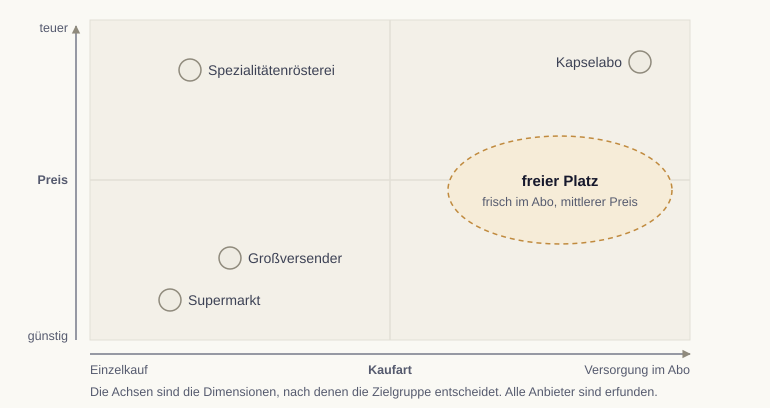

# Positionierung im Wettbewerbsumfeld

In dieser Lesson lernen wir, wie ein Angebot einen klaren und unterscheidbaren Platz im Kopf der Zielgruppe einnimmt, und wie sich eine Positionierung in einem Satz festhalten lässt.

Segmentierung und Personas klären, wen wir ansprechen. Die Positionierung klärt, als was wir wahrgenommen werden wollen. Sie ist der dritte Schritt im STP-Modell und beantwortet die Frage, warum sich jemand für dieses Angebot und gegen den Wettbewerb entscheidet [@kotler2022].

## Was Positionierung bedeutet

Positionierung ist kein Slogan, sondern ein gezielt aufgebauter Eindruck. Sie verankert das Angebot mit einem klaren Nutzenversprechen in der Wahrnehmung einer Zielgruppe, abgegrenzt vom Wettbewerb.

## Die Position im Wettbewerb finden

Hilfreich ist der Blick auf die für die Zielgruppe entscheidenden Dimensionen, etwa Preis und Leistung oder Spezialisierung und Breite. Wer diese Dimensionen aufspannt, sieht, wo der Wettbewerb steht und welche Lücke das eigene Angebot besetzen kann.

Für die Rösterei Morgenrot spannen wir Preis und Kaufart auf. Günstige Einzelkäufe decken Supermarkt und Großversender ab, teure Spezialitäten eine Spezialitätenrösterei, das teure Abo ein Kapselanbieter. Frei ist frischer Kaffee im Abo zum mittleren Preis. Dort sitzen die Homeoffice-Haushalte, und Röstdatum plus fester Lieferrhythmus können den Platz halten.

{#fig-positionierungskarte fig-alt="Achsenkreuz aus Kaufart und Preis. Supermarkt und Großversender stehen bei günstig und Einzelkauf, eine Spezialitätenrösterei bei teuer und Einzelkauf, ein Kapselabo bei teuer und Abo. Frei ist der Bereich mittlerer Preis und Abo."}

::: {.callout-tip title="Analogie: die Landkarte im Kopf"}
Die Zielgruppe ordnet Angebote nach wenigen Merkmalen, etwa Preis und Kaufart. Wo schon jemand steht, ist es schwer, ihn zu verdrängen. Eine freie Stelle lohnt sich, wenn dort genug Menschen suchen und das eigene Angebot sie halten kann.
:::

## Eine Positionierung formulieren

Eine bewährte Vorlage hält die Positionierung in zwei kurzen Sätzen fest: Für [Zielgruppe], die [Bedürfnis], ist [Angebot] [Kategorie], die/der/das [Nutzen]. Anders als [Alternative] [Beleg].

Ein Beispiel: „Für Menschen im Homeoffice, die jeden Morgen frischen Kaffee wollen, ohne ans Nachbestellen zu denken, ist Morgenrot das Kaffee-Abo, das nie leer läuft. Anders als Supermarkt und Großversender röstet Morgenrot erst nach der Bestellung und liefert im festen Rhythmus mit Röstdatum.“

::: {.callout-important title="Eine Position, nicht fünf"}
Eine Positionierung wirkt nur, wenn sie fokussiert ist. Wer alles gleichzeitig sein will, günstig, hochwertig, schnell und persönlich, besetzt am Ende keinen klaren Platz.
:::
