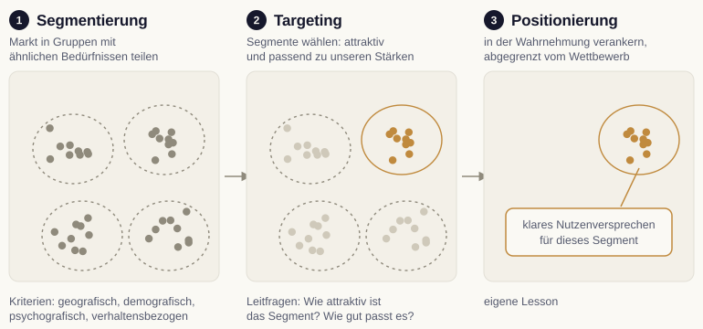

# Segmentierung und Targeting (STP)

Kein Markt ist homogen. Menschen unterscheiden sich in Bedürfnissen, Vorlieben und Verhalten. Der Ansatz, diese Vielfalt produktiv zu nutzen, statt sie zu ignorieren, geht auf den Gründungstext der Marktsegmentierung zurück [@smith1956]. Aus ihm leitet sich das STP-Modell ab: Segmentierung, Targeting, Positionierung. Die ersten beiden Schritte behandeln wir hier, die Positionierung in einem eigenen Kapitel.

{#fig-stp-modell fig-alt="Drei Felder mit Punkten für Menschen im Markt. Segmentierung: vier umrandete Gruppen. Targeting: eine Gruppe hervorgehoben, die übrigen blass. Positionierung: nur die gewählte Gruppe mit einem klaren Nutzenversprechen."}

## Warum wir segmentieren

Ein Angebot, das alle ansprechen soll, spricht am Ende niemanden richtig an. Segmentierung teilt den Markt in Gruppen mit ähnlichen Bedürfnissen, sodass wir Botschaft und Angebot auf eine Gruppe zuschneiden können.

::: {.callout-important title="Segmentierung ist ein Umsetzungsproblem"}
Segmente entstehen nicht von allein in den Daten. Sie werden in Organisationen aktiv erarbeitet und angewendet. Wer Segmente nur definiert, aber nicht in Prozesse überführt, gewinnt wenig [@venter2015].
:::

## Segmentierungskriterien

Für die Aufteilung haben sich vier Gruppen von Kriterien etabliert.

| Kriterium | Beispiele |
|---|---|
| Geografisch | Region, Stadt, Land, Klima |
| Demografisch | Alter, Geschlecht, Bildung, Einkommen |
| Psychografisch | Werte, Lebensstil, Interessen |
| Verhaltensbezogen | Nutzung, Anlass, Loyalität, Suchintention |

In der Praxis kombinieren wir mehrere Kriterien. Gerade verhaltensbezogene Merkmale, etwa die Suchintention, sind im digitalen Marketing besonders aussagekräftig.

## Targeting: Segmente auswählen

Nach der Aufteilung wählen wir die Segmente aus, die wir bedienen wollen. Zwei Fragen leiten die Auswahl: Wie attraktiv ist das Segment (Größe, Wachstum, Wettbewerb), und wie gut passt es zu unseren Stärken?

## Grenzen der Segmentierung

Die Käuferverhaltensforschung des Ehrenberg-Bass-Instituts stellt der klassischen Segmentierung empirische Befunde entgegen, die für jede Zielgruppenentscheidung wichtig sind [@sharp2010]. Über viele Kategorien hinweg unterscheiden sich die Käuferinnen und Käufer konkurrierender Marken in Demografie und Einstellungen kaum. Marken wachsen vor allem über mehr Käufer, also über Marktdurchdringung, und weniger über die Loyalität eines Kernsegments. Ein großer Teil des Umsatzes stammt von Gelegenheitskäufern, die die Marke selten kaufen und wenig über sie nachdenken. Entscheidend sind demnach mentale Verfügbarkeit (die Marke fällt in der Kaufsituation ein) und physische Verfügbarkeit (sie ist leicht zu kaufen).

Für unsere Arbeit folgt daraus eine Unterscheidung. Segmentierung leistet viel bei der Wahl von Botschaft, Kanal und Angebot: Ein Ratgeber für Homeoffice-Haushalte spricht anders als ein Angebot für Büros. Sie eignet sich weniger als Begründung dafür, den Markt eng zu ziehen und alle anderen Käufergruppen auszublenden. Für die Rösterei Morgenrot heißt das: Die Kommunikation richtet sich an Homeoffice-Haushalte, das Abo bleibt aber für jeden leicht zu finden und zu bestellen, und die Marke soll auch bei Menschen einfallen, die nur zweimal im Jahr Kaffee verschenken.

::: {.callout-important title="Ein Segment ist eine Hypothese"}
Ob ein Segment wirklich anders kauft als der übrige Markt, ist eine empirische Frage. Wir prüfen sie an Bestell- und Befragungsdaten, bevor wir Budget danach verteilen. Ein Segment, das sich nur in der Beschreibung unterscheidet und nicht im Verhalten, rechtfertigt keine eigene Kampagne.
:::
