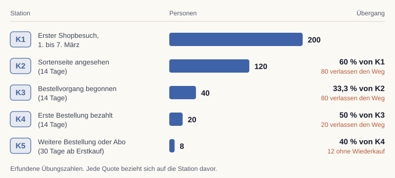
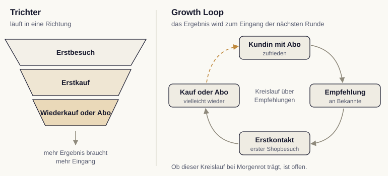
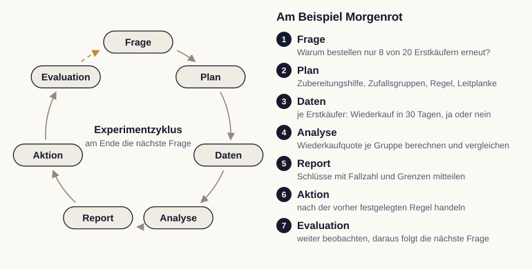

# Growth Marketing: vom Kundenweg zur Hypothese

Die Rösterei Morgenrot verkauft Kaffee im eigenen Onlineshop, einzeln und im Abo. Jede Woche kommen neue Menschen in den Shop. Einige sehen sich Sorten an, wenige bestellen, und nur ein Teil davon bestellt ein zweites Mal oder schließt ein Abo ab. Growth Marketing betrachtet diese Übergänge als zusammenhängendes System. Wir lernen in diesem Kapitel, den Kundenweg in Zahlen zu lesen, ihn mit AARRR zu ordnen und daraus eine Hypothese mit Prüfkriterium abzuleiten.

## Was Growth Marketing ausmacht

Der Begriff geht auf Sean Ellis zurück, der um 2010 für junge Softwareunternehmen die Rolle des „Growth Hackers" beschrieb. Gemeint war eine Arbeitsweise, die Wachstum systematisch sucht, statt es allein von Kampagnen zu erwarten [@ellis2017]. Drei Merkmale unterscheiden Growth Marketing von klassischer Kampagnenplanung.

Erstens betrachten wir den ganzen Kundenweg. Neue Kontakte zu gewinnen ist nur eine Stelle. Oft liegt ein größerer Hebel darin, dass Erstkunden wiederkommen oder weiterempfehlen. Zweitens arbeiten Marketing, Produkt, Service und Datenanalyse an denselben Kennzahlen. Drittens gilt jede Idee zunächst als Vermutung. Wir prüfen sie in kleinen, messbaren Schritten, bevor wir sie breit ausrollen.

Seit generative KI Texte, Bilder und Anzeigenvarianten in Minuten erzeugt, sind Ideen und Varianten billig geworden. Knapp bleiben zwei Dinge: eine gut begründete Hypothese und eine saubere Messung. Genau darauf konzentriert sich dieses Kapitel.

## Den Kundenweg in Zahlen lesen

Im Kapitel zum Marketingbegriff haben wir die Kundenreise als Folge von Stationen kennengelernt (@fig-kundenreise). Für Growth Marketing zählen wir, wie viele Personen von einer Station zur nächsten gelangen. Dazu betrachten wir eine Kohorte, also eine Gruppe, die zur selben Zeit startet. Die folgenden Zahlen sind für Übungszwecke erfunden.

| Station | Beschreibung | Personen |
|---|---|---:|
| K1 | Erster Shopbesuch zwischen dem 1. und 7. März | 200 |
| K2 | Mindestens eine Sortenseite angesehen (14 Tage) | 120 |
| K3 | Bestellvorgang begonnen (14 Tage) | 40 |
| K4 | Erste Bestellung bezahlt (14 Tage) | 20 |
| K5 | Weitere Bestellung oder Abo innerhalb von 30 Tagen nach dem Erstkauf | 8 |

: Kundenweg einer erfundenen Kohorte der Rösterei Morgenrot {#tbl-kohorte}

Eine Übergangsquote braucht drei Angaben: einen Zähler, einen Nenner und einen Zeitraum. Vom ersten Besuch zur Sortenseite gelangen 120 von 200 Personen innerhalb von 14 Tagen, das sind 60 Prozent. Gezählt werden Personen, keine Seitenaufrufe. Wer eine Sortenseite fünfmal öffnet, zählt einmal. Beim Wiederkauf ändert sich der Bezugspunkt. Er wird ab dem Erstkauf beobachtet und auf die Erstkäufer bezogen, nicht auf alle 200 Besucher.

In @fig-kohorte-kundenweg sehen wir alle Übergänge der Kohorte. Zwischen K1 und K2 sowie zwischen K2 und K3 gehen je 80 Personen verloren. Relativ ist der zweite Verlust größer, denn dort steigen zwei Drittel aus.

{#fig-kohorte-kundenweg fig-alt="Fünf Stationen mit Balken: K1 erster Shopbesuch 200 Personen, K2 Sortenseite angesehen 120 (60 Prozent von K1, 80 verlassen den Weg), K3 Bestellvorgang begonnen 40 (33,3 Prozent von K2, 80 verlassen den Weg), K4 erste Bestellung bezahlt 20 (50 Prozent von K3, 20 verlassen den Weg), K5 weitere Bestellung oder Abo in 30 Tagen ab Erstkauf 8 (40 Prozent von K4, 12 ohne Wiederkauf)."}

::: {.callout-important title="Der größte Verlust ist nicht automatisch der beste Ansatzpunkt"}
Die Tabelle zeigt, wo Menschen den Weg verlassen. Sie zeigt nicht, warum. Vielleicht fehlen Informationen, vielleicht passt der Preis nicht, vielleicht kauft jemand später im Supermarkt. Ob wir den größten Verlust absolut oder relativ messen, verändert zudem die Rangfolge. Für die Wahl des Ansatzpunkts zählen deshalb auch die vermutete Ursache, die Kosten einer Änderung und der mögliche Beitrag zum Ergebnis.
:::

## AARRR: fünf Fragen an den Kundenweg

Dave McClure hat 2007 fünf Kennzahlenbereiche für junge Unternehmen vorgeschlagen und nach ihren Anfangsbuchstaben AARRR genannt [@mcclure2007]. Wir nutzen sie als Fragenliste, mit der wir jeden Abschnitt des Kundenwegs ansprechen.

| Bereich | Leitfrage | Beispiel bei Morgenrot |
|---|---|---|
| Acquisition | Wie entsteht ein passender Erstkontakt? | Neue Personen im Shop, nach Herkunftskanal |
| Activation | Wann erlebt jemand zum ersten Mal einen Nutzen? | Die erste Tasse schmeckt wie erwartet; ein Seitenaufruf allein belegt das nicht |
| Retention | Wer kommt wieder? | Anteil der Erstkäufer mit weiterer Bestellung oder Abo in 30 Tagen |
| Referral | Wer empfiehlt weiter? | Neue Kontakte über nachverfolgbare Empfehlungen |
| Revenue | Wie entsteht Umsatz, und was bleibt davon? | Bezahlte Bestellungen abzüglich Rabatten, Versand und Werbekosten |

: AARRR als Fragenliste am Beispiel der Rösterei {#tbl-aarrr}

Die Reihenfolge der Buchstaben ist kein fester Ablauf. Eine Empfehlung kann vor dem ersten Kauf stehen, Umsatz entsteht bereits beim Erstkauf. Manche Darstellungen ergänzen vorne eine Stufe für Bekanntheit (Awareness). Wichtig ist, dass jeder Bereich eine eigene, genau definierte Kennzahl erhält. Unsere Kohortentabelle deckt Acquisition, einen Teil von Revenue und Retention ab. Zu erlebtem Nutzen und Empfehlungen enthält sie keine Daten.

## Growth Loop und Experimentzyklus

Ein Trichter läuft in eine Richtung: Oben kommen Menschen hinein, unten kommen Kunden heraus. Ein Growth Loop beschreibt dagegen einen Mechanismus, bei dem das Ergebnis eines Durchlaufs zum Eingang des nächsten wird [@balfour2018]. Bei Morgenrot wäre ein Empfehlungskreislauf denkbar: Eine zufriedene Abo-Kundin empfiehlt die Rösterei, daraus entsteht ein Erstkontakt, ein Kauf und vielleicht die nächste Empfehlung. Ein zweites Beispiel ist ein Inhaltekreislauf: Zubereitungsanleitungen werden über Suchmaschinen gefunden und bringen neue Besucher, von denen einige kaufen. Ob ein solcher Loop bei Morgenrot existiert und wie stark er ist, wissen wir nicht. Empfehlungen können ausbleiben und kosten Aufwand.

{#fig-trichter-loop fig-alt="Links ein Trichter mit drei Stufen, Erstbesuch, Erstkauf, Wiederkauf oder Abo, darunter: mehr Ergebnis braucht mehr Eingang. Rechts ein Empfehlungskreislauf: Kundin mit Abo, Empfehlung, Erstkontakt, Kauf oder Abo, und ein gestrichelter Pfeil zurück zur Kundin mit Abo. Ob dieser Kreislauf bei Morgenrot trägt, ist offen."}

Der Experimentzyklus beschreibt etwas anderes, nämlich die Arbeit des Teams. @ellis2017 gliedern ihn in vier Schritte: Daten analysieren, Ideen sammeln, Ideen priorisieren und testen. Aus jedem Test entsteht Wissen, das in die nächste Runde einfließt.

Feiner gegliedert beschreiben wir den Zyklus in sieben Stufen: Frage, Plan, Daten, Analyse, Report, Aktion und Evaluation (@fig-experimentzyklus). Bei Morgenrot beginnt er mit der Frage, warum nur 8 von 20 Erstkäufern erneut bestellen. Aus der Evaluation entsteht die nächste Frage, deshalb schließt sich der Kreis.

{#fig-experimentzyklus fig-alt="Links ein Kreis aus sieben Stufen: Frage, Plan, Daten, Analyse, Report, Aktion, Evaluation, ein gestrichelter Pfeil führt zurück zur Frage. Rechts je Stufe das Beispiel Morgenrot: Warum bestellen nur 8 von 20 Erstkäufern erneut? Plan mit Zubereitungshilfe, Zufallsgruppen, Entscheidungsregel und Leitplanke; Wiederkauf in 30 Tagen je Erstkäufer erheben; Wiederkaufquote je Gruppe vergleichen; Schlüsse mit Fallzahl und Grenzen mitteilen; nach der Regel handeln; weiter beobachten und die nächste Frage ableiten."}

| | Growth Loop | Experimentzyklus |
|---|---|---|
| Beschreibt | einen Wachstumsmechanismus im Markt | die Arbeitsweise des Teams |
| Ergebnis eines Durchlaufs | neue Kunden oder Kontakte | geprüftes Wissen und eine Entscheidung |
| Beispiel | Empfehlung, Erstkauf, weitere Empfehlung | Frage, Hypothese, Vergleich, Auswertung |

: Growth Loop und Experimentzyklus im Vergleich {#tbl-loop-zyklus}

::: {.callout-tip title="Analogie: Werkstatt und Labor"}
Der Growth Loop ist die Maschine in der Werkstatt, die im besten Fall immer wieder Nachschub für ihren eigenen Eingang erzeugt. Der Experimentzyklus ist das Labor daneben, in dem wir prüfen, ob eine Änderung an der Maschine tatsächlich etwas verbessert. Ein regelmäßiger Berichtstermin ist deshalb kein Growth Loop. Er gehört ins Labor.
:::

## Eine Hypothese mit Prüfkriterium

Eine Hypothese verbindet eine Änderung mit einer erwarteten Wirkung und einer vermuteten Ursache: Wenn wir X ändern, dann verändert sich Y, weil Z. Für die Rösterei könnte sie lauten: Wenn Erstkäufer eine Woche nach der Lieferung eine kurze Zubereitungshilfe zu ihrer Sorte erhalten, dann bestellen innerhalb von 30 Tagen mehr von ihnen erneut, weil ein enttäuschendes erstes Ergebnis seltener wird.

Der Weil-Teil ist eine Annahme. Eine alternative Erklärung wäre, dass ein Beutel Kaffee schlicht länger als 30 Tage reicht. Dann würde die Zubereitungshilfe wenig ändern, und die Wiederkaufquote wäre die falsche Kennzahl für diesen Zeitraum.

Aus einer Vermutung wird erst dann eine prüfbare Hypothese, wenn wir vor dem Test festlegen, woran wir Erfolg erkennen. Dieses Prüfkriterium umfasst vier Angaben [@kohavi2020]:

1. **Zielkennzahl mit Nenner und Zeitraum:** Anteil der zugeteilten Erstkäufer mit weiterer Bestellung innerhalb von 30 Tagen.
2. **Vergleich:** Eine Gruppe erhält die Zubereitungshilfe, eine Vergleichsgruppe nicht. Der Zufall entscheidet über die Zuteilung.
3. **Entscheidungsregel:** Ab welchem Unterschied wir die Änderung übernehmen. Diese Schwelle legen wir vorher fest, damit wir das Ergebnis nicht nachträglich schönreden.
4. **Leitplanke:** Eine Kennzahl, die sich nicht verschlechtern darf, etwa Abmeldungen vom Newsletter oder Servicekosten.

::: {.callout-note title="Kleine Zahlen brauchen Geduld"}
Bei 20 Erstkäufern pro Woche wären Unterschiede von wenigen Personen zwischen zwei Gruppen kaum vom Zufall zu unterscheiden. Ein Test müsste über mehrere Wochen laufen, bis genügend Fälle zusammenkommen. Wie viele Fälle nötig sind, klären wir bei der Planung des Experiments. Diese Frage gehört von Anfang an zur Hypothese.
:::

Für die praktische Arbeit halten wir alles auf einer Hypothesenkarte fest: den gewählten Übergang, die Beobachtung mit Zähler, Nenner und Zeitraum, zwei mögliche Erklärungen, die Hypothese im Wenn-dann-weil-Format, die Zielkennzahl, die Leitplanke und die Information, die vor der Umsetzung noch fehlt. Die Karte ist ein Vorschlag für einen späteren Test. Sie ist noch kein Testergebnis. Im nächsten Schritt planen wir daraus ein Experiment mit Varianten, zufälliger Zuteilung, Gruppengröße und Auswertung.

## KI im Growth-Prozess

KI-Werkzeuge unterstützen mehrere Schritte des Experimentzyklus. Sie fassen Kundenrezensionen und Serviceanfragen zusammen und liefern so Kandidaten für mögliche Erklärungen. Sie formulieren Hypothesen vor und erzeugen Varianten für Texte und Bilder. Die Prüfung ersetzen sie nicht. Wer mit KI zwanzig Varianten gleichzeitig testet, erhöht die Wahrscheinlichkeit, dass eine davon rein zufällig besser aussieht [@kohavi2020]. Deshalb bleibt die Regel: wenige, gut begründete Hypothesen, jeweils mit vorher festgelegtem Prüfkriterium.

::: {.callout-tip title="Hypothesenkarte in fünf Minuten"}
Wir wählen einen einzigen Übergang aus unserem eigenen Kundenweg. Wir notieren die Quote mit Zähler, Nenner und Zeitraum und schreiben zwei mögliche Erklärungen daneben. Dann formulieren wir einen Wenn-dann-weil-Satz und eine Leitplanke. Prüfkriterium: Eine Kollegin könnte ohne Rückfrage sagen, welches Testergebnis zur Übernahme der Änderung führen würde.
:::
