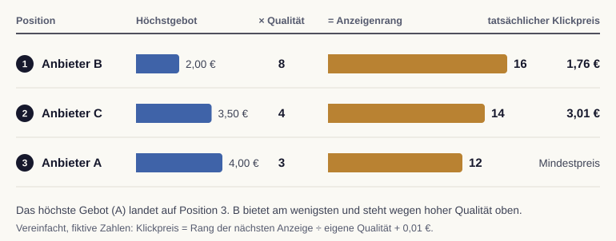

# Funktionsweise von Google Ads und Auktionen

Wir öffnen dieses Modul mit der Frage, die hinter jeder bezahlten Suchanzeige steht: Warum erscheint genau diese Anzeige auf genau dieser Position, und was kostet das? Die Antwort liegt in einer automatisierten Auktion, die bei jeder Suchanfrage Platzierung und Preis bestimmt.

## Jede Suchanfrage startet eine Auktion

Sobald jemand einen Suchbegriff eingibt, prüft Google in Sekundenbruchteilen, welche Werbetreibenden auf passende Keywords bieten, und startet eine eigene Auktion für genau diese Anfrage. Es gibt also keine festen Plätze, die sich kaufen lassen, sondern für jede einzelne Suche wird neu entschieden, welche Anzeigen erscheinen und in welcher Reihenfolge.

Wichtig ist dabei eine Erkenntnis, die wir für das ganze Modul mitnehmen: Die Platzierung hängt nicht allein vom höchsten Gebot ab. Wer am meisten bietet, steht nicht automatisch ganz oben. Stattdessen kombiniert Google das Gebot mit der Qualität der Anzeige und mit dem Kontext der Suche [@shemshaki2025].

## Der Anzeigenrang entscheidet über die Position

Die zentrale Größe, die über die Reihenfolge entscheidet, heißt Anzeigenrang (Ad Rank). Vereinfacht ergibt er sich aus dem maximalen Gebot und der erwarteten Qualität der Anzeige. Ein höherer Anzeigenrang bedeutet eine bessere Position. Genau deshalb kann eine durchdachte, relevante Anzeige mit moderatem Gebot eine teure, aber schlecht gemachte Anzeige überholen.

::: {.callout-tip title="Analogie: Die Auftragsvergabe im Handwerksbetrieb"}
Wir stellen uns einen Handwerksbetrieb vor, der einen Auftrag vergibt. Den Zuschlag bekommt nicht zwangsläufig die Firma mit dem höchsten Angebot, sondern jene, bei der Preis und nachgewiesene Qualität zusammen am meisten überzeugen. Genauso gewichtet die Anzeigenauktion das Gebot und die Anzeigenqualität gemeinsam, statt nur auf die Zahl zu schauen.
:::

## Wir zahlen meist weniger als unser Gebot

Eine zweite Eigenschaft der Auktion ist für das Budget besonders wichtig: Der tatsächliche Klickpreis ist in der Regel niedriger als das eigene Höchstgebot. Vereinfacht zahlen wir nur so viel, wie nötig ist, um die nächstplatzierte Anzeige knapp zu übertreffen. Das Gebot ist also eine Obergrenze, nicht der feste Preis pro Klick.

{#fig-anzeigenrang fig-alt="Tabelle mit Balken für drei Anbieter. Position 1: B, Gebot 2,00 Euro, Qualität 8, Anzeigenrang 16, Klickpreis 1,76 Euro. Position 2: C, 3,50 Euro, Qualität 4, Rang 14, Klickpreis 3,01 Euro. Position 3: A, 4,00 Euro, Qualität 3, Rang 12, Mindestpreis."}

Diese Logik schützt davor, dauerhaft zu viel zu bezahlen, und belohnt zugleich gute Anzeigen mit niedrigeren Kosten. Damit die Auktion fair und stabil bleibt, arbeitet Google zusätzlich mit Mindestpreisen, unterhalb derer eine Anzeige nicht ausgeliefert wird. Solche Reservepreise sind ein bewusst gestaltetes Element von Anzeigenauktionen und beeinflussen sowohl die Einnahmen der Plattform als auch das Verhalten der Werbetreibenden [@ostrovsky2023].

::: {.callout-important title="Gebot ist eine Obergrenze, kein Festpreis"}
Wir verwechseln das maximale Gebot nicht mit den realen Kosten. Das Gebot legt fest, wie viel wir höchstens zu zahlen bereit sind. Der abgerechnete Klickpreis liegt meist darunter und hängt vom Wettbewerb und von der Qualität unserer Anzeige ab.
:::

## Gebot und Budget als Entscheidung

Wie viel ein Klick wert ist, folgt aus dem Geschäft, nicht aus der Auktion. Für die Rösterei Morgenrot bleiben nach Wareneinsatz und Versand rund 10 Euro Deckungsbeitrag je Erstbestellung. Führt jeder zwanzigste Klick zu einer Bestellung, darf ein Klick höchstens 50 Cent kosten, wenn die Erstbestellung sich allein tragen soll. Rechnen wir Wiederkäufe und Abos ein, also den Kundenwert aus dem Kapitel zu den Kennzahlensystemen, steigt die Grenze. Diese Rechnung legt den Ziel-CPA fest, also die Kosten, die eine Bestellung höchstens verursachen darf.

Google Ads bietet für die Umsetzung zwei Wege. Bei manuellen Geboten legen wir je Keyword ein Höchstgebot fest. Bei automatisierten Strategien (Smart Bidding) geben wir ein Ziel vor, etwa einen Ziel-CPA oder einen Ziel-ROAS, und das System setzt je Auktion ein Gebot aus Signalen wie Gerät, Standort, Tageszeit und bisherigem Verhalten [@googleSmartBidding2026]. Die Automatik braucht dafür Conversion-Daten in ausreichender Zahl; bei wenigen Bestellungen pro Monat lernt sie langsam und schwankt stark. Sie optimiert außerdem nur das Ziel, das wir ihr geben: Ein Ziel-CPA für „Bestellung“ behandelt eine Probierpackung für 6 Euro und ein Jahresabo gleich, sofern wir keine Conversion-Werte übergeben.

| Strategie | Was wir vorgeben | Wann sie passt | Risiko |
|---|---|---|---|
| Manueller CPC | Höchstgebot je Keyword | wenige Conversions, enge Kontrolle, Lernphase | Zeitaufwand, keine Signale je Auktion |
| Ziel-CPA | Kosten je Conversion | stabile Conversion-Zahl, ein Zieltyp | lernt langsam bei kleinen Zahlen |
| Ziel-ROAS | Umsatz je Werbe-Euro | Conversion-Werte liegen vor, unterschiedliche Warenkörbe | ROAS ist kein Gewinn |
| Conversions maximieren | nur das Budget | Budget soll vollständig ausgegeben werden | Kosten je Conversion können steigen |

Das Budget entscheidet über die zweite Frage: wie viel insgesamt. Mit steigendem Budget kaufen wir zunehmend Auktionen, in denen wir schlechter platziert sind oder die weniger kaufbereite Menschen erreichen. Die Kosten je zusätzlicher Bestellung steigen deshalb, während der Durchschnitt noch gut aussieht. Für die Budgetentscheidung zählt der Grenzbeitrag: Bringt der nächste Hundert-Euro-Schritt noch Bestellungen, deren Deckungsbeitrag über den zusätzlichen Kosten liegt? Diese Frage beantwortet kein Bericht aus dem Werbekonto von selbst. Wir lesen sie aus dem Vergleich von Wochen mit unterschiedlichem Budget oder aus einem geplanten Test ab.

::: {.callout-important title="Zugeordnete Conversions sind keine zusätzlichen Käufe"}
Suchanzeigen auf den eigenen Markennamen erreichen oft Menschen, die ohnehin gekauft hätten. Ein Feldexperiment bei eBay zeigte, dass der Großteil der über Markensuchanzeigen zugeordneten Käufe auch ohne die Anzeigen zustande kam [@blake2015]. Vor einer Budgeterhöhung fragen wir deshalb, welche Bestellungen die Anzeige tatsächlich zusätzlich auslöst. Das Kapitel zur Attribution zeigt, wie sich das messen lässt.
:::
