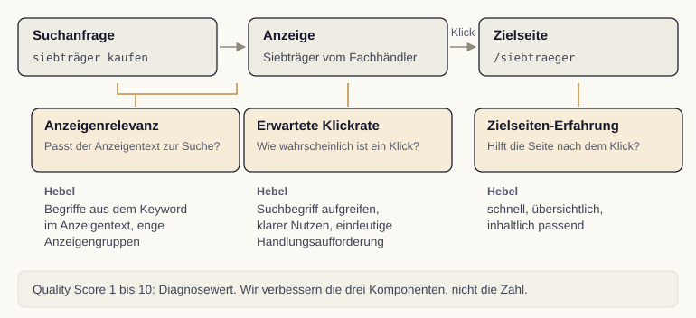

# Quality Score und Optimierung

Wir kennen nun die Auktion und den Kontoaufbau und wenden uns der Stellschraube zu, die beides verbindet: der Anzeigenqualität. Der Quality Score macht sie in drei Komponenten sichtbar, und an jeder lässt sich konkret ansetzen.

## Was der Quality Score misst

Der Quality Score ist eine Diagnosekennzahl auf einer Skala von 1 bis 10, die anzeigt, wie gut unsere Anzeige zu einem bestimmten Keyword passt. Er fließt nicht als einzelne Zahl direkt in die Auktion ein, sondern seine zugrunde liegenden Komponenten beeinflussen den Anzeigenrang. Der historische Diagnosewert fasst Qualitätsaspekte zusammen; die Auktion bewertet Qualität und Kontext für die jeweilige Suche neu. Ein höherer Quality Score garantiert deshalb weder einen günstigeren Klick noch eine bessere Position [@googleQualityScore2024].

Wir behandeln den Quality Score deshalb als Wegweiser, nicht als Selbstzweck. Er zeigt uns, wo eine Anzeige hakt, und lenkt unsere Optimierung auf die richtigen Stellen [@shemshaki2025].

## Drei Komponenten, drei Hebel

Der Quality Score setzt sich aus drei Komponenten zusammen, die Google getrennt bewertet [@googleQualityScore2024]. Die erwartete Klickrate (Expected CTR) schätzt, wie wahrscheinlich ein Klick auf die Anzeige ist, wenn sie für ein Keyword erscheint. Die Anzeigenrelevanz (Ad Relevance) bewertet, wie gut der Anzeigentext zur Suchanfrage passt. Die Nutzererfahrung mit der Zielseite (Landing Page Experience) beurteilt, wie hilfreich und passend die Seite ist, auf der Besucher nach dem Klick landen.

{#fig-quality-score fig-alt="Oben Suchanfrage, Anzeige und Zielseite. Darunter Anzeigenrelevanz, erwartete Klickrate und Zielseiten-Erfahrung mit je einem Hebel. Unten der Hinweis, dass der Quality Score ein Diagnosewert ist."}

## An den richtigen Hebeln ziehen

Aus den drei Komponenten ergeben sich drei konkrete Ansatzpunkte. Für eine bessere erwartete Klickrate schreiben wir Anzeigentexte, die den Suchbegriff aufgreifen und einen klaren Nutzen sowie eine eindeutige Handlungsaufforderung enthalten. Für eine höhere Anzeigenrelevanz sorgen wir dafür, dass die Begriffe aus dem Keyword auch im Anzeigentext vorkommen, was uns die enge thematische Gliederung der Anzeigengruppen aus dem vorigen Kapitel erleichtert. Für eine bessere Zielseiten-Erfahrung achten wir auf eine schnelle, übersichtliche und inhaltlich passende Seite.

::: {.callout-important title="Komponenten verbessern, nicht die Zahl jagen"}
Wir optimieren nicht die Quality-Score-Zahl als solche, sondern die drei Komponenten dahinter. Wir prüfen Verbesserungen an erwarteter Klickrate, Relevanz und Zielseiten-Erfahrung anhand tatsächlicher Ergebnisse. Wettbewerb, Gebote und Suchkontext können sich gleichzeitig ändern; sinkende Kosten folgen nicht automatisch. Die Zahl ist das Thermometer, die Komponenten sind die Heizung.
:::
