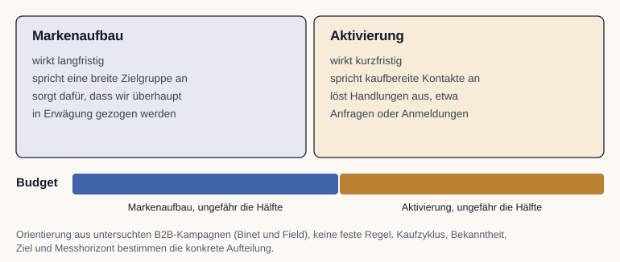

# LinkedIn-Grundlagen und B2B-Wirkungsprinzipien

In dieser Lesson klären wir, warum LinkedIn im B2B-Marketing eine besondere Rolle spielt und wie Markenaufbau und kurzfristige Aktivierung zusammenspielen. Wir lernen die Logik kennen, nach der wirksame B2B-Kampagnen ihr Budget verteilen.

LinkedIn ist ein berufliches Netzwerk. Für eine konkrete Kampagne ist die erreichbare Zielgruppe im gewählten Markt wichtiger als eine globale Mitgliederzahl. Anders als auf rein privaten Plattformen sind Menschen hier in ihrer beruflichen Rolle unterwegs. Berufliche Profile erleichtern die Auswahl passender Zielgruppen, belegen aber keine aktuelle Kaufbereitschaft. Für das B2B-Marketing ist dieser berufliche Kontext der entscheidende Vorteil.

## Warum LinkedIn im B2B wirkt

Im Geschäftskundengeschäft kaufen selten Einzelpersonen, sondern Einkaufsgremien aus mehreren Personen, und der Entscheidungsweg zieht sich oft über Monate. Genau hier setzt LinkedIn an, weil die Plattform die beruflichen Profile dieser Menschen abbildet. Wir können Inhalte gezielt an Fachfunktionen, Branchen und Unternehmensgrößen ausspielen, statt breit zu streuen.

Wirksamkeit entsteht dabei nicht allein über das Format der Anzeige, sondern über die Glaubwürdigkeit der Quelle und die Relevanz der Botschaft [@balaji2023]. Beiträge, die von einer Person mit erkennbarer Expertise stammen und einen echten fachlichen Mehrwert liefern, erzeugen mehr Resonanz als anonyme Werbebotschaften.

::: {.callout-tip title="Analogie: die Fachmesse"}
LinkedIn funktioniert wie eine dauerhaft geöffnete Fachmesse. Auf einer Branchenmesse treffen wir gezielt Menschen in ihrer Berufsrolle, knüpfen Kontakte und führen Fachgespräche, statt zufällige Passanten auf der Straße anzusprechen. Ein guter Messeauftritt überzeugt durch Substanz und einen kompetenten Ansprechpartner, nicht durch das lauteste Plakat. Genauso wirkt LinkedIn am besten mit fachlich glaubwürdigen Inhalten in einem beruflichen Umfeld.
:::

## Markenaufbau und Aktivierung im Gleichgewicht

Eine der wichtigsten Erkenntnisse des B2B-Marketings betrifft die Aufteilung des Budgets zwischen zwei Aufgaben. Markenaufbau wirkt langfristig, spricht eine breite Zielgruppe an und sorgt dafür, dass ein Unternehmen überhaupt in Erwägung gezogen wird. Aktivierung wirkt kurzfristig, spricht kaufbereite Kontakte an und löst konkrete Handlungen wie Anfragen oder Anmeldungen aus.

Binet und Field diskutieren für B2B eine ungefähr hälftige Verteilung auf Markenaufbau und Aktivierung [@binetField2019; @linkedinB2bBalance2026]. Das ist eine Orientierung aus untersuchten Kampagnen, keine für jedes Unternehmen optimale Budgetregel. Kaufzyklus, Bekanntheit, Ziel und Messhorizont bestimmen die konkrete Aufteilung. Wer ausschließlich auf kurzfristige Abschlüsse optimiert, kann den langfristigen Markenaufbau vernachlässigen. Ob dadurch Wachstum ausbleibt, hängt vom Markt, der bestehenden Bekanntheit und weiteren Maßnahmen ab.

{#fig-marke-aktivierung fig-alt="Zwei Kästen mit den Merkmalen von Markenaufbau und Aktivierung, darunter ein ungefähr hälftig geteilter Budgetbalken und der Hinweis auf Binet und Field als Orientierung."}

::: {.callout-important title="Häufige Stolperfalle"}
Viele Kampagnen messen nur kurzfristige Abschlüsse und kürzen deshalb zuerst das Budget für den Markenaufbau. Das wirkt kurzfristig effizient, schwächt aber mittelfristig die gesamte Nachfrage. Wir prüfen deshalb bei jeder Kampagne, ob sie auf Markenaufbau oder auf Aktivierung einzahlt, und halten beide Aufgaben im Gleichgewicht.
:::

## Ohne Werbebudget: Unternehmensseite und eigene Beiträge

Nicht jede Wirkung auf LinkedIn kostet Werbebudget. Grundlage ist eine gepflegte Unternehmensseite, denn wer eine Anzeige sieht, schaut oft zuerst dort nach. Wir achten auf ein Titelbild, eine Beschreibung, die in den ersten Sätzen sagt, was der Betrieb für wen anbietet, einen Link zur Website und einen Button wie „Website besuchen“ oder „Kontakt“.

Für eigene Beiträge bietet LinkedIn mehrere Formate. Ein Dokument-Beitrag ist ein PDF, das sich im Feed durchblättern lässt; er eignet sich für Anleitungen und Checklisten. Eine Umfrage holt schnell eine Meinung ein. Ein Newsletter bündelt regelmäßige Fachbeiträge, und wer ihn abonniert, wird bei jeder Ausgabe benachrichtigt. Live-Übertragungen passen zu Veranstaltungen.

Mitarbeitende haben eigene Netzwerke, die eine Unternehmensseite nicht erreicht. Teilen und kommentieren sie Inhalte des Unternehmens, spricht man von Employee Advocacy. Das funktioniert nur freiwillig und mit Inhalten, hinter denen die Mitarbeitenden selbst stehen.

::: {.callout-note title="Beispiel: die Rösterei ohne Werbebudget"}
Die Rösterei Morgenrot veröffentlicht auf ihrer Unternehmensseite einen Dokument-Beitrag „Kaffee im Büro: fünf Fragen vor dem ersten Abo“. Die Röstmeisterin teilt ihn mit einem eigenen Satz aus ihrem Arbeitsalltag. Die Beschreibung der Seite nennt im ersten Satz, was die Rösterei anbietet: Kaffee-Abos für Büros und Privatkundschaft.
:::

## Share of Voice als Wachstumshebel

Mit der Frage nach Markeninvestitionen verbunden ist der Anteil der eigenen Werbestimme am Markt, der sogenannte Share of Voice. Damit ist gemeint, wie groß der eigene Werbeanteil im Verhältnis zu allen Wettbewerbern eines Marktes ist. Tendenziell wächst ein Unternehmen, wenn sein Share of Voice größer ist als sein aktueller Marktanteil, weil es sich überdurchschnittlich Aufmerksamkeit sichert.

Für die Praxis bedeutet das, kontinuierlich präsent zu bleiben, statt nur in kurzen Kampagnenfenstern aufzutauchen. Dauerhafte Sichtbarkeit baut die mentale Verfügbarkeit auf, die später über den Abschluss entscheidet. Vertiefend ordnet @seebacher2023 diese Prinzipien in die Gesamtstrategie des B2B-Marketings ein.
