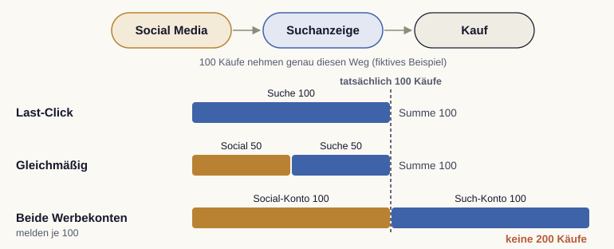

# Attribution und Dashboards

Wir klären zwei eng verwandte Fragen. Erstens: Welchem Kanal schreiben wir einen Erfolg gut, wenn die Kundschaft über viele Kontaktpunkte zu uns findet? Das ist die Frage der Attribution. Zweitens: Wie machen wir die Antworten so sichtbar, dass sie zu Entscheidungen führen? Das leisten Dashboards, etwa in Looker Studio.

## Das Zurechnungsproblem

Eine Conversion entsteht selten nach einem einzigen Kontakt. Eine Person sieht vielleicht eine Anzeige, liest später einen Blogbeitrag, klickt Tage darauf auf eine Suchanzeige und kauft erst dann. Jede dieser Stationen ist ein Touchpoint, ein Berührungspunkt mit unserer Marke. Attribution beschreibt, wie wir erfasste Conversions nach einer Regel oder einem Modell diesen Berührungspunkten zurechnen. Diese Zuordnung ist noch kein Nachweis ihres ursächlichen Beitrags.

Diese Verteilung ist keine technische Nebensache, sondern entscheidet über die Budgetlenkung. Wenn wir falsch zurechnen, verschieben wir Geld zu den falschen Kanälen. Die Forschung zeigt, dass eine realistische Zurechnung über mehrere Kontaktpunkte hinweg die Wirkung einzelner Kanäle deutlich anders bewertet als eine vereinfachte Betrachtung [@li2014].

::: {.callout-tip title="Analogie: Das Tor im Mannschaftssport"}
Wir stellen uns ein Tor im Fußball vor. Es wäre ungerecht, allein der Person den Erfolg zuzuschreiben, die den Ball über die Linie bringt. Das Tor entsteht aus einer Kette: Ballgewinn, Pass, Vorlage, Abschluss. Genauso entsteht eine Conversion aus einer Kette von Kontaktpunkten. Attribution ist der Versuch, diese Vorlagen sichtbar zu machen und nicht nur den letzten Schritt zu zählen.
:::

## Vom Last-Click zu datengetriebenen Modellen

Lange galt eine einfache Regel: Der letzte Klick vor dem Kauf bekommt den gesamten Erfolg. Dieses Last-Click-Modell ist leicht zu verstehen, blendet bei der Zurechnung aber alle früheren Kontakte aus. Daraus folgt weder, dass frühere Kontakte wirkungslos waren, noch, dass der letzte Kontakt den Kauf verursacht hat.

Deshalb haben sich differenziertere Ansätze durchgesetzt. Manche Modelle verteilen den Erfolg gleichmäßig auf alle Kontaktpunkte, andere gewichten frühe oder späte Stationen stärker. Datengetriebene Modelle (data-driven attribution) nutzen beobachtete Pfade und Modellannahmen für die Zurechnung [@berman2018]. Auch sie hängen von verfügbaren Signalen, Identifikatoren und Auswertungsfenstern ab; fehlende Kontakte und bereits vorhandene Kaufabsicht können das Bild verzerren.

GA4 stellt für diese Zurechnung eigene Einstellungen bereit. Wir wählen dort bewusst, nach welcher Logik Conversions auf Kanäle verteilt werden, statt die Voreinstellung ungeprüft zu übernehmen [@googleGa4Attribution2026].

::: {.callout-important title="Last-Click ist bequem, aber irreführend"}
Wir verlassen uns nicht allein auf den letzten Klick. Wer nur den finalen Schritt belohnt, kann vorgelagerte Kontakte übersehen. Auch eine mehrstufige Betrachtung beweist jedoch nicht, wie viele Käufe ohne Werbung ausgeblieben wären.
:::

## Dashboards, die Entscheidungen tragen

Die beste Auswertung nützt wenig, wenn sie in Rohdaten verborgen bleibt. Ein Dashboard bündelt die wichtigsten Kennzahlen an einem Ort und macht sie auf einen Blick lesbar. Werkzeuge wie Looker Studio verbinden sich dafür direkt mit GA4 und anderen Datenquellen und stellen die Zahlen als Diagramme und Übersichten dar.

Ein gutes Dashboard folgt denselben Prinzipien wie ein gutes Kennzahlensystem. Es zeigt nicht alles, sondern das Wesentliche, geordnet nach den Aufgaben der Kundenreise. Oben stehen die Leitkennzahlen für den schnellen Gesundheitscheck, darunter die Treiber, die erklären, woher eine Veränderung kommt. So wird aus Daten eine Geschichte, der eine Entscheidung folgen kann [@ahrholdt2023].

Wir richten Dashboards außerdem auf ihr Publikum aus. Die Geschäftsführung braucht den verdichteten Überblick, das Marketing-Team die operativen Details. Dieselben Daten erscheinen also in verschiedener Tiefe, je nachdem, wer mit ihnen arbeitet.

## Zurechnung und zusätzliche Wirkung unterscheiden

Im fiktiven Beispiel führen 100 Käufe jeweils über Social Media und danach eine Suchanzeige. Last-Click schreibt der Suche 100 Käufe zu; eine gleichmäßige Regel ordnet beiden Kanälen je 50 zu. Keine Variante erzeugt zusätzliche Käufe: Der tatsächliche Gesamtwert bleibt 100. Melden beide Werbekonten jeweils 100 zugeordnete Käufe, dürfen wir daraus keine 200 Käufe machen. Wir gleichen Transaktionen und Attributionsfenster mit dem Shop ab.

{#fig-attribution-zurechnung fig-alt="Oben der Weg Social Media, Suchanzeige, Kauf. Darunter Balken: Last-Click gibt der Suche 100 Käufe, die gleichmäßige Regel Social und Suche je 50. Die Berichte beider Werbekonten melden je 100, zusammen 200; eine gestrichelte Linie markiert die tatsächlichen 100 Käufe."}

Zusätzliche Wirkung heißt dagegen: Wie verändert sich das Ergebnis gegenüber einer vergleichbaren Situation ohne diese Maßnahme? Ein vorab geplanter, randomisierter Test mit Kontrollgruppe kann diese Frage beantworten. Ein Vorher-nachher-Vergleich allein vermischt die Maßnahme mit Saison, Nachfrage und anderen Änderungen. Auch im Experiment betrachten wir Unsicherheit, Stichprobengröße und wirtschaftlichen Nutzen getrennt.

**Kurzprüfung:** Wir berechnen für die 100 Käufe beide Zurechnungen und formulieren einen zulässigen Ergebnissatz sowie eine offene Wirkungsfrage. Ins Dashboard gehören neben Zeitraum und Kennzahlendefinition auch Quelle, Attributionsfenster, Modell und erkennbare Datenlücken. Im Planspiel sind ausgewiesene Kanalwerte Ergebnisse der Simulation; sie belegen keine entsprechende Wirkung in einem realen Werbekonto.
