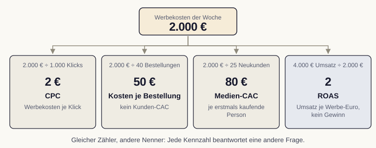

# Kennzahlen und Kennzahlensysteme

Wir messen Marketingerfolg nicht an Applaus, sondern an Wirkung. In dieser Lesson lernen wir, sogenannte Vanity-Metriken von echten Steuerungsgrößen zu unterscheiden und unsere Kennzahlen so entlang der Kundenreise anzuordnen, dass sie zusammen ein stimmiges Bild ergeben.

## Warum Kennzahlen überhaupt zählen

Was wir nicht messen, können wir nicht gezielt verbessern. Kennzahlen übersetzen das, was im Marketing passiert, in nachvollziehbare Zahlen und machen damit Entscheidungen begründbar statt beliebig. Sie zeigen beobachtete Ergebnisse und unterstützen die Prüfung, ob ein eingesetzter Euro Wirkung entfaltet, und sie schaffen eine gemeinsame Sprache zwischen Marketing, Vertrieb und Geschäftsführung.

Wir unterscheiden dabei zwei Begriffe, die oft verwechselt werden. Eine Metrik ist jede messbare Größe, also etwa die Zahl der Seitenaufrufe. Ein KPI (Key Performance Indicator) ist hingegen eine bewusst ausgewählte Schlüsselkennzahl, die direkt auf ein Ziel einzahlt. Jeder KPI ist eine Metrik, aber nicht jede Metrik verdient den Rang eines KPI [@farris2010].

::: {.callout-tip title="Analogie: Das Armaturenbrett im Auto"}
Wir stellen uns das Armaturenbrett eines Autos vor. Dort stehen nicht alle technisch messbaren Werte, sondern nur die wenigen, die für eine sichere Fahrt zählen: Geschwindigkeit, Tankfüllung, Motortemperatur. Genauso wählen wir aus der Fülle möglicher Zahlen jene wenigen aus, die uns wirklich steuern helfen. Ein Cockpit mit fünfzig Anzeigen lenkt nur ab.
:::

## Vanity-Metriken erkennen und einordnen

Manche Zahlen sehen beeindruckend aus, sagen aber wenig über den Geschäftserfolg. Solche Vanity-Metriken (Eitelkeits-Kennzahlen) steigen verlässlich, lassen sich gut präsentieren und führen doch leicht in die Irre. Typische Beispiele sind reine Reichweite, die Gesamtzahl der Follower oder die Menge der Seitenaufrufe ohne jeden Bezug zu einer Handlung.

Das Problem liegt nicht in den Zahlen selbst, sondern in der fehlenden Verbindung zum Ziel. Zehntausend Aufrufe belegen noch keinen Geschäftserfolg; für ein Bekanntheitsziel können sie dennoch ein relevanter Zwischenindikator sein. Wir prüfen deshalb bei jeder Kennzahl, ob sich aus ihr eine Entscheidung ableiten lässt. Eine wertorientierte Kennzahl beantwortet die Frage, ob wir unserem Ziel nähergekommen sind, und lenkt das nächste Handeln [@kaushik2010].

::: {.callout-important title="Eine Zahl ohne Bezugsgröße steuert nicht"}
Wir betrachten absolute Zahlen immer im Verhältnis. Tausend Klicks sind je nach eingesetztem Budget ein Erfolg oder eine Enttäuschung. Erst Relationen wie Conversion-Rate (mit ausdrücklich festgelegtem Zähler und Nenner) oder Kosten pro Conversion machen aus einer rohen Zahl eine steuerbare Größe.
:::

## Kennzahlen entlang der Kundenreise

Kennzahlen wirken einzeln selten überzeugend, im Verbund dagegen sehr. Ein Kennzahlensystem ordnet die wichtigsten Größen so an, dass sie aufeinander aufbauen und gemeinsam den Weg der Kundschaft abbilden. Wir orientieren uns dabei an den vier Aufgaben der Kundenreise aus dem ersten Modul: Anwerben, Überzeugen, Gewinnen und Binden. In der Fachliteratur heißt dieser Weg oft Customer Journey.

Beim Anwerben messen wir Sichtbarkeit und Aufmerksamkeit, etwa über Reichweite oder neue Besuchende. Beim Überzeugen rückt das Interesse in den Blick, sichtbar an Verweildauer oder wiederkehrenden Besuchen. Beim Gewinnen zählt die Handlung, also die Conversion und ihr Wert. Beim Binden zeigen Wiederkäufe und Kündigungen, ob die Kundschaft bleibt. So entsteht ein Trichter, in dem jede Stufe ihre eigene Leitkennzahl trägt und auf eine übergeordnete Zielgröße einzahlt [@ahrholdt2023].

Damit dieses System trägt, wählen wir bewusst wenige Schlüsselkennzahlen statt vieler Anzeigen. Vier bis fünf gut gewählte KPIs reichen aus, um eine Kampagne zu steuern. Mehr Zahlen erhöhen nicht die Klarheit, sondern den Aufwand der Interpretation.

## Zähler, Nenner und Kosten sauber trennen

Für einen fiktiven Shop betrachten wir eine vollständig erfasste Woche: 2.000 Euro Werbekosten, 1.000 Anzeigenklicks, 800 zuordenbare Shop-Sitzungen, 40 Bestellungen aus 36 dieser Sitzungen, 25 erstmals kaufende Personen und 4.000 Euro zugeordneter Nettoumsatz. Alle Bestellungen liegen im selben definierten Auswertungsfenster.

| Kennzahl | Rechnung | Aussage |
|---|---|---|
| CPC | 2.000 / 1.000 = 2 Euro | Werbekosten je Klick |
| Bestellungen je Klick | 40 / 1.000 = 4 % | Bestellhäufigkeit je Anzeigenklick |
| Sitzungen mit Kauf / Sitzungen | 36 / 800 = 4,5 % | Anteil der Shop-Sitzungen mit mindestens einem Kauf |
| Kosten je Bestellung | 2.000 / 40 = 50 Euro | Werbekosten pro Bestellung, kein Kunden-CAC |
| Medien-CAC | 2.000 / 25 = 80 Euro | Werbekosten je neu gewonnener Person |
| ROAS | 4.000 / 2.000 = 2 | Zugeordneter Nettoumsatz je Werbe-Euro, kein Gewinn |

{#fig-kostenbezug fig-alt="Oben ein Kasten mit 2.000 Euro Werbekosten. Darunter vier Kästen: 2.000 Euro geteilt durch 1.000 Klicks ergibt einen CPC von 2 Euro; durch 40 Bestellungen 50 Euro Kosten je Bestellung, kein Kunden-CAC; durch 25 Neukunden einen Medien-CAC von 80 Euro; 4.000 Euro Umsatz geteilt durch 2.000 Euro einen ROAS von 2, kein Gewinn."}

Der vollständige CAC berücksichtigt zusätzlich die abgegrenzten Kosten der Kundengewinnung, etwa Vertrieb und Agentur. Wiederholungskäufe erhöhen die Bestellzahl, aber nicht die Zahl neu gewonnener Personen. Ein ROAS von 2 deckt bei 40 Prozent Deckungsbeitrag vor Werbung nur 1.600 Euro der 2.000 Euro Werbekosten; nach Werbung bleiben minus 400 Euro, noch vor weiteren Fixkosten.

Bei fehlenden Trackingtagen berechnen wir eine Rate nur aus zusammengehörigen Zählern und Nennern derselben vollständig erfassten Tage. Tatsächlich angefallene Kosten und Shop-Bestellungen bleiben für die wirtschaftliche Gesamtbetrachtung relevant. Fehlend ist nicht null.

**Kurzprüfung:** Wir erklären ohne KI, weshalb 40 / 800 = 5 Prozent nicht dieselbe Kennzahl wie die sitzungsbezogene Kaufrate ist und weshalb 50 Euro kein CAC sind. Danach nennen wir eine Information, die für zusätzliches Budget fehlt: etwa der erwartete zusätzliche Deckungsbeitrag der nächsten 100 Euro. Der bisherige Durchschnitts-ROAS allein beantwortet diese Frage nicht.
