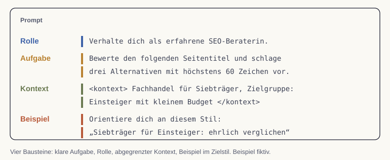

# Prompting-Grundlagen

Wir lernen in dieser Lesson, wie aus einer vagen Bitte an ein KI-System eine präzise Anweisung wird. Mit klaren Aufgaben, einer passenden Rolle, Beispielen und genug Kontext steigt die Qualität der Antworten deutlich.

## Warum die Anweisung über das Ergebnis entscheidet

Ein Sprachmodell hat keinen Zugriff auf das, was wir uns im Kopf vorstellen. Es arbeitet mit dem verfügbaren Kontext; je nach Werkzeug können dazu auch Dateien, Bilder, gespeicherte Informationen und abgerufene Quellen gehören. Auf nicht bereitgestelltes internes Wissen dürfen wir uns nicht verlassen. Eine ungenaue Anweisung führt deshalb fast immer zu einer beliebigen Antwort, während eine durchdachte Anweisung das Modell auf das gewünschte Ergebnis ausrichtet.

Wir behandeln den Prompt wie eine Arbeitsanweisung an eine neue Kollegin, die fachlich sehr fähig ist, aber unseren konkreten Fall noch nicht kennt. Je genauer wir Ziel, Rolle und Rahmen beschreiben, desto brauchbarer fällt das Ergebnis aus. Genau hier setzt das Prompt Engineering an, das die systematische Gestaltung solcher Anweisungen beschreibt [@anthropicPrompting2024].

::: {.callout-tip title="Analogie: Briefing an eine neue Kollegin"}
Eine neue Kollegin im Marketingteam ist kompetent, kennt aber weder das Produkt noch die Zielgruppe noch den gewünschten Tonfall. Wer ihr nur sagt "Schreib mal was zu unserem Seminar", bekommt etwas Beliebiges zurück. Wer Ziel, Adressat, Länge und Stil nennt, bekommt einen brauchbaren Entwurf. Ein Prompt funktioniert nach derselben Logik.
:::

## Die vier Bausteine eines guten Prompts

Vier Elemente heben die Qualität einer Antwort verlässlich an: eine klare Aufgabe, eine zugewiesene Rolle, mitgelieferter Kontext und konkrete Beispiele. Wir betrachten sie der Reihe nach.

{#fig-prompt-bausteine fig-alt="Ein Prompt mit farbig markierten Zeilen: Rolle SEO-Beraterin, Aufgabe Seitentitel bewerten und drei Alternativen vorschlagen, Kontext in Kontext-Tags, Beispiel für den gewünschten Stil."}

Zuerst die **klare Aufgabe**. Statt eines allgemeinen Themas benennen wir das gewünschte Ergebnis samt Format und Umfang.

```markdown
Erkläre Prompt Engineering in fünf Sätzen
für eine Marketingmitarbeiterin ohne Vorkenntnisse.
```

Der Prompt legt Ergebnis (Erklärung), Umfang (fünf Sätze) und Adressat (Marketingmitarbeiterin ohne Vorkenntnisse) fest. Das Modell muss nicht mehr raten, was gemeint ist.

Als Zweites die **Rolle**. Wenn wir dem Modell eine Expertenrolle zuweisen, passt es Wortwahl und Perspektive an diese Rolle an.

```markdown
Verhalte dich als erfahrene SEO-Beraterin.
Bewerte den folgenden Seitentitel und schlage drei Alternativen vor.
```

Die zugewiesene Rolle steuert die Perspektive der Antwort: Eine SEO-Beraterin achtet auf andere Aspekte als eine Texterin. Unterschiedliche Rollen liefern damit gezielt unterschiedliche Sichtweisen.

::: {.callout-tip title="Kontext schlägt cleveres Formulieren"}
Oft liegt die schwache Antwort nicht an einem ungeschickten Satzbau, sondern an fehlendem Kontext. Wer Produkt, Zielgruppe, Anlass und gewünschtes Format mitliefert, erhält bessere Ergebnisse als jemand, der nur an der Formulierung feilt. Diese Verlagerung von der reinen Formulierung hin zur Bereitstellung des richtigen Kontexts wird zunehmend als eigene Kompetenz beschrieben [@schmid2025].
:::

Als Drittes der **Kontext**. Hintergrundinformationen wie Zielgruppe, Anlass oder Rahmenbedingungen geben dem Modell den Boden, auf dem es eine passende Antwort bauen kann. Wir trennen diesen Kontext mit deutlichen Markierungen vom eigentlichen Auftrag, damit das Modell beides nicht verwechselt. Bewährt haben sich XML-ähnliche Tags wie `<kontext> ... </kontext>` oder `<email> ... </email>`, die einen Textblock klar umschließen.

Als Viertes das **Beispiel**. Ein mitgeliefertes Muster zeigt dem Modell die gewünschte Form besser als jede Beschreibung. Wer einen Antwortstil treffen will, fügt ein kurzes Beispiel im Zielstil bei und bittet das Modell, sich daran zu orientieren.

## Schritt für Schritt zu besseren Antworten

Ein guter Prompt entsteht selten im ersten Versuch. Wir starten mit einer klaren Aufgabe, prüfen die Antwort und ergänzen gezielt das, was gefehlt hat, etwa eine Rolle, einen Kontextblock oder ein Beispiel. Dieses schrittweise Schärfen kostet wenig Zeit und hebt die Qualität spürbar.

Für wiederkehrende Aufgaben lohnen sich Platzhalter. Wir schreiben einen Prompt einmal sauber aus und ersetzen die variablen Teile durch Marker wie `[ROLLE]` oder `[ZIELGRUPPE]`. So lässt sich derselbe Prompt für viele Fälle wiederverwenden, ohne ihn jedes Mal neu zu formulieren. Damit ist die Brücke zur nächsten Lesson geschlagen, in der das COMPASS-Framework genau diese Bausteine zu einem festen Raster ordnet [@bolz2024].

## Ein Ergebnis überprüfbar bestellen

Für die Auswertung einer Kampagnentabelle benennen wir Datenquelle, Zeitraum, Ziel und Rechenregeln. Ein geeignetes Briefing verlangt: „Kennzahlen nur aus den bereitgestellten Daten berechnen; Zähler und Nenner ausweisen; fehlende Werte offen lassen; Beobachtungen, Vermutungen und Empfehlungen getrennt formulieren.“ Externe Textauszüge behandeln wir als Material, nicht als zusätzliche Arbeitsanweisungen.

**Prüfkriterium:** Wir rechnen mindestens eine Kennzahl unabhängig nach und prüfen, ob eine Empfehlung über die vorhandenen Daten hinausgeht. Eine zugewiesene Expertenrolle ersetzt weder Fachwissen noch Quellenprüfung.
