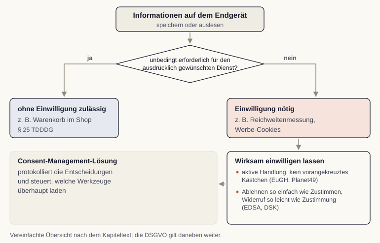

# Recht im digitalen Marketing: Datenschutz, Einwilligung, KI-Transparenz

Digitales Marketing arbeitet mit personenbezogenen Daten, mit Werbung in fremden Postfächern und zunehmend mit maschinell erzeugten Inhalten. Für alle drei Bereiche gibt es klare Regeln. Wir verschaffen uns einen Überblick, der ausreicht, um Vorhaben einzuordnen, Rückfragen an Fachleute zu stellen und typische Fehler zu vermeiden.

## Die Grundprinzipien der Datenschutz-Grundverordnung

Die Datenschutz-Grundverordnung (DSGVO) erlaubt die Verarbeitung personenbezogener Daten nur, wenn eine Rechtsgrundlage vorliegt. Für das Marketing sind drei Grundlagen praktisch bedeutsam: die Einwilligung, die Erfüllung eines Vertrags und das berechtigte Interesse [@dsgvo2016].

| Rechtsgrundlage | Typischer Fall im Marketing | Worauf wir achten |
|---|---|---|
| Einwilligung (Art. 6 Abs. 1 lit. a) | Newsletter, Tracking über das technisch Notwendige hinaus | freiwillig, informiert, durch aktive Handlung, jederzeit widerrufbar, nachweisbar |
| Vertrag (Art. 6 Abs. 1 lit. b) | Bestellabwicklung, Kundenkonto, Versandinformationen | nur Daten, die für die Leistung erforderlich sind |
| Berechtigtes Interesse (Art. 6 Abs. 1 lit. f) | Missbrauchsabwehr, interne Auswertungen in engem Rahmen | dokumentierte Abwägung, Widerspruchsrecht beachten |

Hinzu kommen Grundsätze, die unabhängig von der Rechtsgrundlage gelten: Zweckbindung erlaubt die Nutzung nur für den Zweck der Erhebung, Datenminimierung begrenzt den Umfang auf das Nötige, Speicherbegrenzung verlangt Löschfristen. Die Informationspflichten sorgen dafür, dass betroffene Personen verständlich erfahren, wer welche Daten wofür verarbeitet und an wen sie weitergegeben werden.

::: {.callout-tip title="Analogie: Der Besucherausweis am Empfang"}
Eine Einwilligung funktioniert wie ein Besucherausweis. Er wird bewusst ausgestellt, gilt für einen bestimmten Bereich und für eine bestimmte Zeit, und er lässt sich zurückgeben. Niemand betritt das Gebäude, weil der Ausweis schon vorbereitet auf dem Tresen lag. Genauso wenig entsteht eine Einwilligung durch ein vorausgefülltes Kästchen.
:::

## Einwilligung beim Tracking

Für Zugriffe auf das Endgerät gilt in Deutschland zusätzlich das Telekommunikation-Digitale-Dienste-Datenschutz-Gesetz (TDDDG, früher TTDSG). Nach dessen § 25 dürfen Informationen auf einem Endgerät nur gespeichert oder ausgelesen werden, wenn eine Einwilligung vorliegt. Ausgenommen sind Vorgänge, die für den ausdrücklich gewünschten Dienst unbedingt erforderlich sind, etwa der Warenkorb eines Shops. Reichweitenmessung, Werbe-Cookies und ähnliche Techniken fallen nicht darunter [@tdddg2024].

Der Europäische Gerichtshof hat im Verfahren Planet49 zwei Punkte geklärt: Ein vorangekreuztes Kästchen ist keine wirksame Einwilligung, und über die Speicherdauer sowie den Zugriff Dritter ist zu informieren [@eughPlanet49]. Für heutige Einwilligungsbanner folgt daraus die aktive Handlung statt einer Voreinstellung. Dass Ablehnen genauso einfach erreichbar sein muss wie Zustimmen, ergibt sich nicht aus diesem Urteil, sondern aus den Vorgaben der Aufsichtsbehörden, also des Europäischen Datenschutzausschusses (EDSA) und der Datenschutzkonferenz (DSK). Dass der Widerruf so leicht sein muss wie die Zustimmung, steht in Art. 7 Abs. 3 DSGVO selbst. Eine Consent-Management-Lösung protokolliert die Entscheidungen und steuert, welche Werkzeuge überhaupt laden.

{#fig-einwilligung-tracking fig-alt="Entscheidungsweg: Speichern oder Auslesen auf dem Endgerät; ist es für den gewünschten Dienst unbedingt erforderlich, ist es ohne Einwilligung zulässig, sonst ist eine Einwilligung nötig. Diese braucht eine aktive Handlung, Ablehnen muss so einfach wie Zustimmen sein, der Widerruf so leicht wie die Zustimmung; eine Consent-Management-Lösung protokolliert und steuert das Laden der Werkzeuge."}

## E-Mail-Marketing

Werbliche E-Mails setzen nach § 7 Abs. 2 Nr. 2 UWG eine vorherige ausdrückliche Einwilligung voraus. In der Praxis sichern wir sie über das Double-Opt-in-Verfahren: Nach der Anmeldung folgt eine Bestätigungsmail, erst der Klick darin schaltet den Versand frei. Für einen nachvollziehbaren Nachweis dokumentieren wir zusätzlich Inhalt und Version der Einwilligungserklärung sowie Anmeldung und Bestätigung [@uwg].

Eine eng gefasste Ausnahme für Bestandskundschaft enthält § 7 Abs. 3 UWG. Sie greift nur, wenn alle vier Voraussetzungen erfüllt sind: Die Adresse wurde im Zusammenhang mit dem Verkauf einer Ware oder Dienstleistung erhoben, sie wird für Direktwerbung für eigene ähnliche Waren oder Dienstleistungen genutzt, die Kundschaft hat nicht widersprochen, und sie wurde bei Erhebung und bei jeder Verwendung klar auf das Widerspruchsrecht hingewiesen.

## Messen ohne Cookies von Drittanbietern

Cookies fremder Anbieter verlieren an Bedeutung, teils durch Browsereinstellungen, teils durch rechtliche Vorgaben. Der Schwerpunkt verschiebt sich auf eigene Daten aus Shop, Kundenkonto und Newsletter, die wir mit Einwilligung erheben und selbst verwalten. Serverseitiges Tagging verlagert die Datenübergabe auf einen eigenen Server, ersetzt die Einwilligung aber nicht. Fehlende Signale werden von Werbeplattformen zunehmend über Modellierung geschätzt, etwa im Rahmen eines Einwilligungsmodus (Consent Mode). Chrome hat die vollständige Abschaltung der Cookies von Drittanbietern zurückgenommen, die Richtung bleibt aber bestehen: Einwilligung und eigene Daten tragen die Messung, nicht fremde Kennungen. Welche browserseitigen Ersatzverfahren sich durchsetzen, ist offen, weshalb wir Auswertungen so aufbauen, dass sie auch mit unvollständigen Daten belastbar bleiben.

## KI-Transparenz nach dem AI Act

Die KI-Verordnung der Europäischen Union, die Verordnung (EU) 2024/1689 (AI Act), ordnet Anwendungen nach Risiko: Einige Praktiken sind verboten, Hochrisiko-Anwendungen unterliegen strengen Anforderungen, für weitere Systeme gelten Transparenzpflichten [@euAiAct2024]. Ein eigenes Regime betrifft KI-Modelle mit allgemeinem Verwendungszweck (General Purpose AI, GPAI), also die großen Sprach- und Bildmodelle, deren Anbieter Dokumentations- und Urheberrechtspflichten treffen.

Für das Marketing ist Artikel 50 einschlägig, und er verteilt die Pflichten auf Anbieter und Betreiber. Anbieter trifft zweierlei: Systeme, die direkt mit Menschen interagieren, müssen so gestaltet sein, dass die betroffenen Personen das erkennen (Absatz 1), und synthetische Ausgaben sind maschinenlesbar als künstlich erzeugt oder bearbeitet zu markieren (Absatz 2). Beides leistet das Werkzeug, nicht das Marketingteam, woraus für uns eine Beschaffungsfrage wird: Einen Chatbot kaufen oder konfigurieren wir nur so, dass er für Nutzende erkennbar als KI auftritt, und ein Bildwerkzeug wählen wir danach, ob es seine Ausgaben markiert.

Als Betreiber trifft uns vor allem Absatz 4. Wer täuschend echte Darstellungen realer Personen, Objekte oder Orte veröffentlicht, also Deepfakes, legt offen, dass der Inhalt künstlich erzeugt oder verändert wurde; für KI-Texte, die zur Information der Öffentlichkeit über Angelegenheiten von öffentlichem Interesse veröffentlicht werden, gilt eine entsprechende Offenlegung. Für diese Texte enthält Absatz 4 eine Ausnahme: menschliche Überprüfung oder redaktionelle Kontrolle und redaktionelle Verantwortung einer natürlichen oder juristischen Person. Absatz 3 betrifft Emotionserkennung und biometrische Kategorisierung und spielt im Marketing selten eine Rolle. Eine allgemeine Pflicht, jedes mit KI erstellte Werbebild zu kennzeichnen, folgt aus alldem nicht.

Die Verordnung ist am 1. August 2024 in Kraft getreten und gilt gestuft. Die verbotenen Praktiken greifen seit dem 2. Februar 2025, die Pflichten für GPAI-Modelle seit dem 2. August 2025, Artikel 50 gilt seit dem 2. August 2026. Den Anwendungsbeginn bestätigt die Europäische Kommission in ihren Leitlinien zu den Transparenzpflichten [@euAiTransparency2026]. Für die konkrete Anwendung prüfen wir zusätzlich Ausnahmen und Übergangsvorschriften der jeweils geltenden Fassung; aus diesem Datum folgt keine einheitliche Frist für alle übrigen Pflichten.

Bereits in Kraft ist dagegen Artikel 4: Anbieter und Betreiber sorgen dafür, dass ihr Personal über ein ausreichendes Maß an KI-Kompetenz verfügt, gemessen an Vorkenntnissen, Aufgabe und Einsatzkontext. Diese Pflicht gilt seit dem 2. Februar 2025 und trifft damit auch Marketingteams, die generative Werkzeuge einsetzen, weshalb wir Schulung im Kapitel zur Organisation fest in den Pilotversuch einplanen.

## Werbekennzeichnung und Haftung

Unabhängig vom Datenschutz gilt das Wettbewerbsrecht: Werbung muss als Werbung erkennbar sein, auch in Beiträgen von Kooperationspartnern, und irreführende Angaben zu Eigenschaften, Verfügbarkeit oder Preisen sind unzulässig. Bei KI-erzeugten Inhalten kommt hinzu, dass Modelle Fakten erfinden und fremde Marken oder Personenbildnisse einbauen können. Die Verantwortung für Veröffentlichtes bleibt beim Unternehmen, weshalb jede Ausgabe vor der Verwendung geprüft wird [@kreutzer2025].

::: {.callout-important title="Kurzcheck vor dem Kampagnenstart"}
Vier Fragen klären wir vor jeder Kampagne: Erstens, liegt für jede Datenverarbeitung eine Rechtsgrundlage vor, und wird die Einwilligung sauber eingeholt und dokumentiert? Zweitens, sind Impressum, Datenschutzhinweise und Werbekennzeichnung vollständig? Drittens, welche Daten fließen an welche Dienstleister, und bestehen die nötigen Verträge? Viertens, sind Deepfakes offengelegt, und tritt ein eingesetzter Chatbot für Nutzende erkennbar als KI auf?
:::

::: {.callout-note title="Einordnung"}
Dieses Kapitel vermittelt Orientierungswissen für Entscheidungen und ersetzt keine Rechtsberatung. Bei konkreten Vorhaben ziehen wir juristische Fachkunde hinzu.
:::
