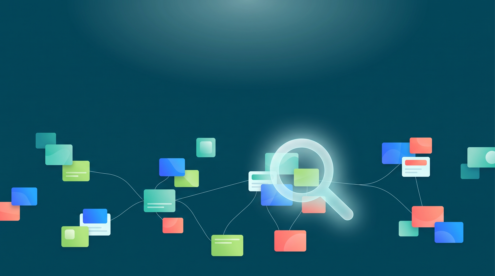

# Fragen beantworten, bevor Budget fließt {.stage background-image="../images/hero-marktforschung-mit-ki.png" background-color="#0a0a0f" background-opacity="0.75"}

<!-- image: profile="stage-hero" file="hero-marktforschung-mit-ki.png"
Moderne, ruhige Szene: auf tiefem Petrol-Blau schweben viele kleine, abstrakte Karten wie Notizzettel, einige davon durch feine helle Linien zu Gruppen verbunden, eine Lupe als schemenhafte Lichtform über einer der Gruppen. Frische, gedeckte Farbakzente, weicher Lichtschein. Viel Negativraum oben für eine Titel-Überlagerung. Kein Text, keine Gesichter, editorial und modern.
-->

::: {.notes}
Marktforschung hat einen schlichten Zweck: Fragen beantworten, bevor Budget fließt. Welche Bedenken hat die Kundschaft, welche Botschaft versteht sie, welcher Preis erscheint ihr angemessen? KI verändert, wie schnell und wie gründlich sich solche Fragen beantworten lassen. Das Deck zeigt zuerst den Prozess und die Methoden, dann die Stellen, an denen KI hilft, und zuletzt die Grenzen.
:::

## Marktforschung folgt fünf Schritten

:::: {.timeline}

::: {.timeline-item}
[01]{.timeline-number}
[Frage]{.timeline-title}
[Was wollen wir wissen, und welche Entscheidung hängt davon ab?]{.timeline-detail}
:::

::: {.timeline-item}
[02]{.timeline-number}
[Design]{.timeline-title}
[Methode, Zielgruppe und Stichprobe festlegen]{.timeline-detail}
:::

::: {.timeline-item}
[03]{.timeline-number}
[Erhebung]{.timeline-title}
[Daten sammeln, etwa per Befragung oder Interview]{.timeline-detail}
:::

::: {.timeline-item}
[04]{.timeline-number}
[Auswertung]{.timeline-title}
[Daten ordnen, zählen und deuten]{.timeline-detail}
:::

::: {.timeline-item}
[05]{.timeline-number}
[Entscheidung]{.timeline-title}
[Empfehlung ableiten, Offenes festhalten]{.timeline-detail}
:::

::::

::: {.sources}
Vereinfacht nach @malhotra2019; @kotler2022
:::

::: {.notes}
Jedes Marktforschungsprojekt folgt demselben Ablauf. Lehrbücher unterscheiden fünf oder sechs Schritte, hier in vereinfachter Form. [KLICK] Am Anfang steht die Frage. Sie benennt auch die Entscheidung, für die das Ergebnis gebraucht wird. [KLICK] Das Design legt Methode und Stichprobe fest. [KLICK] Die Erhebung sammelt die Daten. [KLICK] Die Auswertung ordnet sie. [KLICK] Am Ende steht eine begründete Entscheidung. Der erste Schritt bestimmt den Wert aller weiteren: Die Frage „Was denken unsere Kunden?“ führt zu einer Materialsammlung, die Frage nach konkreten Bedenken vor einem Abschluss dagegen zu einer Grundlage für die Angebotsseite.
:::

## Zwei Unterscheidungen bestimmen die Methode

:::: {.columns}

::: {.column width="50%"}
**Sekundär oder primär?**

- **Sekundär:** vorhandenes Material auswerten, schnell und günstig
- **Primär:** neue Daten für die eigene Frage erheben, aufwendiger, passt genau
:::

::: {.column width="50%"}
**Qualitativ oder quantitativ?**

- **Qualitativ:** fragt nach dem Warum, zeigt Gründe und Begriffe
- **Quantitativ:** fragt nach dem Wie viel, zeigt Häufigkeiten
:::

::::

::: {.tip-box}
Bewährte Reihenfolge: erst vorhandenes Material sichten, dann qualitativ verstehen, dann quantitativ messen.
:::

::: {.sources}
Quelle: @malhotra2019
:::

::: {.notes}
Sekundärforschung wertet vorhandene Studien, Statistiken und Wettbewerberseiten aus. Primärforschung erhebt neue Daten, etwa mit einer eigenen Befragung. [KLICK] Qualitative Forschung zeigt, welche Gründe und Situationen es gibt. Quantitative Forschung zeigt, wie häufig etwas vorkommt. In der Praxis beginnt die Arbeit meist mit vorhandenem Material und führt über Gespräche zur Messung.
:::

## Sechs Online-Methoden, jede mit eigener Grenze

:::: {.features}

::: {.feature}
[]{.accent-blue}
**Desk Research**

Markt und Wettbewerb. Grenze: Herkunft der Quellen
:::

::: {.feature}
[]{.accent-blue}
**Online-Befragung**

Häufigkeiten. Grenze: Wer antwortet, prägt das Ergebnis
:::

::: {.feature}
[]{.accent-blue}
**Interview, auch per Video**

Gründe und Sprache. Grenze: wenige Fälle
:::

::: {.feature}
[]{.accent-green}
**Bewertungen, Social Listening**

Erfahrungen und Stimmung. Grenze: Selbstauswahl
:::

::: {.feature}
[]{.accent-green}
**Web- und Kaufdaten**

Tatsächliches Verhalten. Grenze: Motiv fehlt
:::

::: {.feature}
[]{.accent-green}
**A/B-Test**

Wirkung einer Änderung. Grenze: braucht genug Besuche
:::

::::

::: {.sources}
Quelle: @malhotra2019; @tuten2023
:::

::: {.notes}
Sechs Methoden decken den Großteil der Online-Marktforschung ab. Desk Research sichtet vorhandene Quellen. Online-Befragungen messen Häufigkeiten. Interviews, auch per Video, zeigen Gründe. Social Listening beobachtet öffentliche Onlinegespräche systematisch. Web- und Kaufdaten zeigen, was Menschen tatsächlich tun. Der A/B-Test ist die einzige Methode in dieser Reihe, die eine Wirkung belegen kann: Zwei Varianten gehen an zufällig verteilte Gruppen, das Verhalten wird verglichen.
:::

## KI übernimmt Routine, Menschen das Urteil {.stage background-color="#0a0a0f" data-kicker="Studienbefund"}

In Studien arbeitete ein Hybrid aus Mensch und Sprachmodell effizienter und lieferte reichhaltigere Ergebnisse als Menschen allein.

::: {.sources}
Quelle: @arora2025
:::

::: {.notes}
Die Untersuchung von Arora, Chakraborty und Nishimura im Journal of Marketing hat Sprachmodelle in qualitativen und quantitativen Studien als Mitarbeitende eingesetzt. Die KI übernahm aufwendige Routinearbeit wie Fragebogenentwürfe, Interviews und Zusammenfassungen. Menschen formulierten das Problem, legten das Design fest und entschieden, wo KI nicht passt. Schwächen zeigten die Modelle bei neuen Informationen, kulturellen Besonderheiten und ethisch heiklen Themen.
:::

## KI unterstützt jeden Schritt, Menschen prüfen das Ergebnis

| Schritt | Was KI übernimmt | Was Menschen prüfen |
|---|---|---|
| Frage | Frage schärfen, Hypothesen vorschlagen | Passt die Frage zur Entscheidung? |
| Sekundärforschung | Deep Research über viele Webquellen | Trägt die Originalquelle die Aussage? |
| Design | Fragebogen entwerfen, prüfen, übersetzen | Misst die Frage, was sie soll? |
| Erhebung | Transkription, KI-moderierte Interviews | Faire Gesprächsführung, Datenschutz |
| Auswertung | Kodieren, Themen clustern, Stimmung | Stichprobe von Hand gegenprüfen |
| Bericht | Zusammenfassen, strukturieren | Beobachtung, Deutung, Empfehlung getrennt |

::: {.sources}
Quelle: @arora2025; @grewal2025
:::

::: {.notes}
Die Tabelle überträgt die Arbeitsteilung auf den Prozess. In jeder Zeile steht links, was KI übernehmen kann, und rechts, was ein Mensch prüft. Besonders groß ist der Zeitgewinn bei der Sekundärforschung, beim Fragebogenentwurf und beim Kodieren offener Antworten. Neu sind KI-moderierte Interviews: Sie erlauben deutlich mehr Gespräche, offen bleibt aber, wie gut die KI nachfragt und ob sich Befragte ihr gegenüber anders äußern.
:::

## Deep Research spart Stunden, jede Quelle braucht trotzdem eine Prüfung

:::: {.numbered-sections-container}

::: {.numbered-section}
[01]{.section-number}
[Stimmt es?]{.section-title}
[Aussage prüfen]{.section-subtitle}

- Die Seite enthält genau diese Aussage
:::

::: {.numbered-section}
[02]{.section-number}
[Wer spricht?]{.section-title}
[Absender einordnen]{.section-subtitle}

- Anbieter, Testbericht oder Studie
:::

::: {.numbered-section}
[03]{.section-number}
[Eigene Quelle?]{.section-title}
[Herkunft klären]{.section-subtitle}

- Viele Seiten wiederholen dieselbe Studie
:::

::::

::: {.sources}
Quelle: @openaiDeepResearch2025
:::

::: {.notes}
Viele KI-Assistenten bieten eine Recherche mit Webzugriff an, die mehrere Seiten liest und einen Bericht mit Quellenverweisen erstellt. Das ersetzt Stunden an Desk Research. Die Anbieter weisen aber selbst darauf hin, dass solche Berichte Fakten falsch wiedergeben können. [KLICK] Deshalb folgt eine Prüfung in drei Fragen: Enthält die Seite die Aussage wirklich? [KLICK] Wer spricht dort? [KLICK] Und ist es eine eigene Quelle oder die Wiederholung einer anderen?
:::

## Demo: Deep Research in Gemini

:::: {.columns}
::: {.column width="50%"}
**Ablauf**

1. Deep Research wählen, Auftrag einfügen
2. Rechercheplan prüfen und starten
3. Bericht lesen, nach Google Docs exportieren
:::
::: {.column width="50%"}
**Worauf achten**

- Welche Quellen, welcher Absender?
- Zwei Aussagen an der Quelle prüfen
- Was fehlt im Bericht?
:::
::::

::: {.tip-box}
Der Bericht braucht einige Minuten. Die Recherche läuft, während die Übung beginnt.
:::

::: {.notes}
Die Demo zeigt Deep Research in der Gemini-App am Übungsfall Kaffeeabo. Der Auftrag folgt der Prompt-Vorlage und steht im Buchkapitel sowie in der Lektion zum Kopieren bereit. [KLICK] Gemini legt zuerst einen Rechercheplan vor. Dieser Plan lässt sich vor dem Start anpassen, etwa auf Quellen aus Deutschland. Danach liest das Werkzeug einige Minuten lang Webquellen. In dieser Zeit beginnt die Übung. In der Auswertung werden zwei Aussagen aus dem Bericht an ihrer Quelle geprüft. Dabei zählt, ob die Seite die Aussage wirklich trägt, wer dort spricht und ob mehrere Quellen dieselbe ursprüngliche Studie wiederholen. Als Rückfall liegt ein vorab erzeugter Bericht als Google Doc bereit.
:::

## KI als Prüferin macht einen Fragebogen neutraler

:::: {.comparison}

::: {.comparison-side}
**Entwurf**

- „Wie sehr schätzen Sie unseren schnellen und freundlichen Service?“
- „Kaufen Sie regelmäßig online?“
- „Würden Sie ein Abo abschließen?“
:::

::: {.separator}
:::

::: {.comparison-side .highlighted}
**Nach der KI-Prüfung**

- „Wie bewerten Sie die Lieferzeit?“ und eine eigene Frage zur Freundlichkeit
- „Wie oft haben Sie in den letzten drei Monaten online bestellt?“
- „Haben Sie schon einmal ein Produkt im Abo bezogen?“
:::

::::

::: {.notes}
Links steht ein erster Fragebogen mit drei typischen Fehlern. Die erste Frage ist suggestiv und fragt zwei Dinge zugleich. Die zweite enthält den unklaren Begriff regelmäßig. Die dritte ist hypothetisch und überschätzt die Kaufbereitschaft. [KLICK] Rechts stehen die überarbeiteten Fassungen. Ein kurzer Auftrag genügt: suggestive, doppelte, unklare und hypothetische Fragen markieren, jeden Befund begründen, eine neutrale Fassung vorschlagen. Einen Pretest mit echten Personen ersetzt diese Prüfung nicht.
:::

## Kodieren dauert Minuten, die Gegenprobe bleibt Pflicht

:::: {.comparison}

::: {.comparison-side}
**Von Hand**

- 400 offene Antworten lesen
- Themen bilden und zuordnen
- leicht ein Arbeitstag
:::

::: {.separator}
:::

::: {.comparison-side .highlighted}
**Mit KI**

- Zuordnung in wenigen Minuten, mit Textstelle
- 30 bis 50 Antworten selbst kodieren und vergleichen
- bei Abweichung Themenliste schärfen
:::

::::

::: {.sources}
Quelle: @arora2025
:::

::: {.notes}
Eine Befragung liefert 400 Antworten auf die offene Frage, was beim Bestellen gestört hat. Von Hand dauert das Kodieren leicht einen Arbeitstag. [KLICK] Eine KI ordnet die Antworten in Minuten Themen wie Lieferzeit, Versandkosten oder Bezahlung zu. In Studien erreichten Sprachmodelle bei solchen Analysen das Niveau menschlicher Fachleute. Die Gegenprobe an einer Zufallsstichprobe bleibt trotzdem Pflicht. Typische Fehler sind zu grobe Themen, als Lob gelesene Ironie und ergänzte Details, die nirgends im Text stehen.
:::

## KI-Antworten sind keine Kundendaten {.stage background-color="#0a0a0f" data-kicker="Silicon Samples"}

Ein Sprachmodell kann antworten, als wäre es eine Kundengruppe. Das liefert Hypothesen. Beobachtungen echter Menschen liefert es nicht.

::: {.notes}
Ein neueres Versprechen lautet, Befragte ganz durch KI zu ersetzen. In der Forschung heißen solche künstlichen Stichproben Silicon Samples. Die nächste Folie zeigt, was Studien dazu bisher herausgefunden haben. [PAUSE]
:::

## Silicon Samples treffen manches gut und manches deutlich daneben

:::: {.columns}

::: {.column width="50%"}
**Nah an echten Daten**

- Antwortverteilungen von Teilgruppen, bei passenden Personenangaben (Argyle u. a.)
- Wahrnehmung von Marken und Produkteigenschaften: über 75 Prozent Übereinstimmung (Li u. a.)
:::

::: {.column width="50%"}
**Deutliche Abweichungen**

- Zeitpräferenzen: GPT-Modelle deutlich ungeduldiger als Menschen (Goli und Singh)
- Zahlungsbereitschaft: keine verlässlichen Werte für neue Kategorien und Segmentunterschiede (Brand u. a.)
:::

::::

::: {.tip-box}
Einsatz am Anfang einer Studie: Hypothesen, Vortests, Pilotstudien (Sarstedt u. a.).
:::

::: {.sources}
Quelle: @argyle2023; @li2024; @goli2024; @brand2025; @sarstedt2024
:::

::: {.notes}
Die Befunde sind gemischt. Mit passenden Angaben zur Person gibt ein Sprachmodell Antwortverteilungen menschlicher Teilgruppen erstaunlich gut wieder. Bei Wahrnehmungsanalysen zu Marken und Produkteigenschaften stimmten KI- und Befragungsdaten in über drei Vierteln der Fälle überein. [KLICK] Bei Entscheidungen zwischen früher und später Belohnung antworteten GPT-Modelle dagegen deutlich ungeduldiger als Menschen. Frühere Befragungsdaten verbesserten Schätzungen der Zahlungsbereitschaft, aber nicht für neue Produktkategorien und nicht für Unterschiede zwischen Kundensegmenten. Die Empfehlung aus der Forschung: Silicon Samples am Anfang einer Studie nutzen, für die eigentliche Erhebung echte Menschen befragen.
:::

## Vier Regeln halten KI-gestützte Forschung belastbar

:::: {.features}

::: {.feature}
[]{.accent-orange}
**Auswahl begrenzt die Aussage**

Selbstauswahl und Nichtantwort verzerren, auch bei fehlerfreier Auswertung
:::

::: {.feature}
[]{.accent-blue}
**Jede Aussage braucht einen Beleg**

Textstelle, Quelle oder Datensatz, sonst Vermutung
:::

::: {.feature}
[]{.accent-blue}
**Beobachtung, Deutung, Empfehlung trennen**

„Drei von acht nennen Versandkosten“ ist keine Kundenforderung
:::

::: {.feature}
[]{.accent-orange}
**Datenschutz**

Nur freigegebene Werkzeuge, Personenangaben vorher entfernen
:::

::::

::: {.sources}
Quelle: @cetinkaya2024; @dsgvo2016
:::

::: {.notes}
Vier Regeln halten die Arbeit belastbar. Erstens begrenzt die Auswahl die Aussage: Bewertungen schreiben vor allem sehr zufriedene und sehr unzufriedene Menschen, und an Befragungen nehmen vor allem Interessierte teil. Zweitens braucht jede Aussage einen Beleg. Drittens bleiben Beobachtung, Deutung und Empfehlung getrennt. Viertens gilt der Datenschutz auch für KI-Werkzeuge: Kundendaten gehören nur in freigegebene Werkzeuge, und Namen werden vorher entfernt.
:::

## Übung: Bedenken vor dem Kaffeeabo

:::: {.numbered-sections-container}

::: {.numbered-section}
[01]{.section-number}
[Ordnen]{.section-title}
[mit oder ohne KI]{.section-subtitle}

- Acht erfundene Kundenstimmen nach Themen gruppieren
:::

::: {.numbered-section}
[02]{.section-number}
[Belegen]{.section-title}
[Textstellen nennen]{.section-subtitle}

- Drei Beobachtungen mit Kennungen und Grenzen
:::

::: {.numbered-section}
[03]{.section-number}
[Entscheiden]{.section-title}
[Empfehlung und offene Frage]{.section-subtitle}

- Anbieterseite prüfen, Änderung an der Abo-Seite begründen
:::

::::

::: {.notes}
Die Übung wendet den Ablauf auf einen kleinen Fall an. Die Rösterei Morgenrot möchte ihre Abo-Seite überarbeiten und fragt, welche Bedenken Menschen vor dem Abschluss eines Kaffeeabos haben. Im Team werden acht erfundene Kundenstimmen geordnet, drei Beobachtungen mit Textstellen belegt und eine reale Anbieterseite geprüft. Am Ende stehen eine begründete Empfehlung und eine offene Frage, die eine Befragung klären müsste. Arbeitszeit etwa 25 Minuten, ein KI-Chat ist optional.
:::

## Was bleibt {.stage .closing background-color="#0a0a0f"}

KI macht Marktforschung schneller und gründlicher. Die Frage, das Design und die Prüfung der Ergebnisse bleiben Aufgabe von Menschen.

::: {.notes}
Der Forschungsprozess bleibt derselbe. KI beschleunigt Recherche, Fragebogenentwurf, Interviews und Auswertung. Menschen legen die Frage fest, wählen das Design und prüfen die Ergebnisse an Quellen und Stichproben. Synthetische Befragte liefern Hypothesen, keine Kundendaten.
:::

## Weiter im Buch {.book-bridge}

:::: {.columns}

::: {.column width="30%"}

:::

::: {.column width="70%"}
::: {.chapter-title}
Kapitel: Online-Marktforschung mit KI
:::

Im Online-Buch liegen die Methodenübersicht, beide Beispiele und ein Auftrag für die Fragebogen-Prüfung ausformuliert bereit.

[→ Zum Kapitel](https://kirenz.github.io/online-marketing-ki/02-kundenverstaendnis/marktforschung-mit-ki.html){.fragment .fade-up}
:::

::::

::: {.notes}
Das Buchkapitel vertieft Prozess, Methoden und Studienlage. Dort steht auch ein Auftrag, mit dem sich ein Fragebogen von einer KI auf typische Fehler prüfen lässt.
:::

## Literatur

::: {#refs}
:::

::: {.notes}
Das Literaturverzeichnis baut sich automatisch aus den im Deck zitierten Quellen auf.
:::
