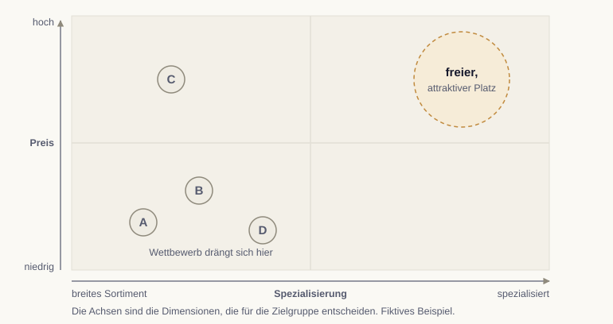

# Der Platz im Kopf {.stage background-image="../images/hero-positionierung.png" background-color="#0a0a0f" background-opacity="0.75"}

<!-- image: profile="stage-hero" file="hero-positionierung.png"
Moderne, frische Komposition: ein Koordinatensystem mit zwei Achsen und einigen Punkten, einer davon klar hervorgehoben in einer freien Ecke, über tiefem Petrol-Blau mit frischen Farbakzenten im weichen Lichtschein. Viel Negativraum oben für eine Titel-Überlagerung. Kein Text, keine Gesichter, editorial und frisch und modern.
-->

::: {.notes}
Segmentierung und Personas klären, wen wir ansprechen. Die Positionierung klärt, als was wir wahrgenommen werden wollen. Sie ist der dritte Schritt im STP-Modell und beantwortet, warum sich jemand für dieses Angebot entscheidet.
:::

## Was Positionierung bedeutet

Positionierung ist kein Slogan, sondern ein gezielt aufgebauter Eindruck. Sie verankert das Angebot mit einem klaren Nutzenversprechen in der Wahrnehmung einer Zielgruppe, abgegrenzt vom Wettbewerb.

::: {.sources}
Quelle: @kotler2022
:::

::: {.notes}
Positionierung wirkt im Kopf der Zielgruppe, nicht im Produktdatenblatt. Sie ist der bewusst aufgebaute Eindruck, der das Angebot unterscheidbar macht und die Wahl gegen den Wettbewerb begründet.
:::

## Die Position im Wettbewerb finden

Hilfreich ist der Blick auf die entscheidenden Dimensionen, etwa Preis und Leistung oder Spezialisierung und Breite. Wer sie aufspannt, sieht, wo der Wettbewerb steht und welche Lücke frei ist.

::: {.notes}
Eine Positionierungs-Matrix mit zwei relevanten Dimensionen zeigt die Landschaft: Wo stehen die Wettbewerber, und welcher attraktive Platz ist noch frei? Genau diese Lücke kann das eigene Angebot besetzen.
:::

## Eine freie, attraktive Position schlägt den Kampf um einen besetzten Platz

{fig-alt="Positionierungskarte mit Spezialisierung und Preis, vier Wettbewerbern und einem freien Platz" width="981px"}

::: {.notes}
Die Achsen sind die Dimensionen, die für die Zielgruppe entscheiden. Im Beispiel drängt sich der Wettbewerb bei breitem Sortiment und niedrigem Preis. Oben rechts ist ein Platz frei. Die Wettbewerber sind fiktiv.
:::

## Eine Positionierung formulieren

::: {.formula .editorial}
Für [Zielgruppe], die [Bedürfnis], ist [Angebot] [Kategorie], die/der/das [Nutzen]. Anders als [Alternative] [Beleg].
:::

::: {.notes}
Diese Vorlage hält die Positionierung in einem Satz fest. Sie zwingt zur Klarheit über Zielgruppe, Bedürfnis, Kategorie, Nutzen, Alternative und Beleg und macht die Position überprüfbar.
:::

## Die Landkarte im Kopf {.stage background-color="#0a0a0f" data-kicker="Analogie"}

Die Zielgruppe ordnet Angebote nach wenigen Merkmalen. Wo schon jemand steht, ist es schwer, ihn zu verdrängen. Eine freie Stelle lohnt sich, wenn dort genug Menschen suchen.

::: {.notes}
Das Bild der Landkarte schließt an die Positionierungskarte an: Die Achsen sind die Merkmale, nach denen die Zielgruppe unterscheidet. Ist der Platz für die günstigste Lösung vergeben, ist es klüger, eine freie Stelle zu besetzen, die sich lohnt und die das eigene Angebot halten kann.
:::

## Was bleibt {.stage .closing background-color="#0a0a0f"}

Eine Positionierung wirkt nur fokussiert. Sie verankert einen klaren Nutzen für eine klare Zielgruppe und schließt das STP-Modell ab.

::: {.notes}
Als Kern bleibt: ein klarer Platz statt vieler halber. Die Positionierung baut auf Segmentierung und Personas auf und liefert die Leitplanke für Botschaft und Content in den nächsten Modulen.
:::

## Literatur

::: {#refs}
:::

::: {.notes}
Das Literaturverzeichnis baut sich automatisch aus den im Deck zitierten Quellen auf.
:::
