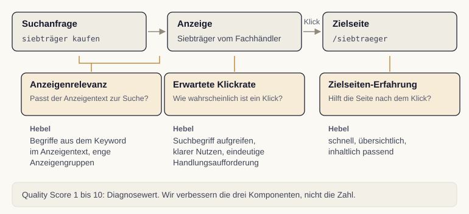

# Qualität, die den Preis senkt {.stage background-image="../images/hero-quality-score.png" background-color="#0a0a0f" background-opacity="0.75"}

<!-- image: profile="stage-hero" file="hero-quality-score.png"
A dark atmospheric background composition suggesting measured quality and calibration: a faintly glowing gauge-like arc and soft concentric rings over a deep blue-black gradient, with three subtle points of light suggesting separate components. Generous negative space in the upper-left for a title overlay. Low-contrast, cinematic, no readable text, no people, no faces, no sharp focal points.
-->

::: {.notes}
Auktion und Kontoaufbau treffen sich in der Anzeigenqualität. Dieser Einstieg führt zum Quality Score als der Stellschraube, die bessere Positionen und niedrigere Kosten zugleich möglich macht.
:::

## Der Quality Score ist ein Wegweiser

Eine Diagnosekennzahl von **1 bis 10** zeigt, wie gut eine Anzeige zu einem Keyword passt.

Wichtig: Die Zahl fließt nicht direkt in die Auktion ein. Ihre **Komponenten** wirken auf den Anzeigenrang.

Der historische Diagnosewert garantiert weder günstigere Klicks noch bessere Positionen.

::: {.sources}
Quelle: @shemshaki2025
:::

::: {.notes}
Der Quality Score ist eine Diagnosekennzahl von 1 bis 10 für die Passung zwischen Anzeige und Keyword. Er fließt nicht als einzelne Zahl in die Auktion ein, sondern seine Komponenten beeinflussen den Anzeigenrang. Qualität und Kontext werden für jede Auktion neu bewertet; der historische Diagnosewert garantiert kein bestimmtes Ergebnis.
:::

## Drei Komponenten, drei Hebel

:::: {.features}

::: {.feature}
[]{.accent-blue}
**Erwartete Klickrate**

Wie wahrscheinlich ein Klick ist.
:::

::: {.feature}
[]{.accent-green}
**Anzeigenrelevanz**

Wie gut der Text zur Suche passt.
:::

::: {.feature}
[]{.accent-orange}
**Zielseiten-Erfahrung**

Wie hilfreich die Seite nach dem Klick ist.
:::

::::

::: {.sources}
Quelle: @googleQualityScore2024
:::

::: {.notes}
Der Quality Score setzt sich aus drei Komponenten zusammen, die Google getrennt bewertet: die erwartete Klickrate als geschätzte Klickwahrscheinlichkeit, die Anzeigenrelevanz als Passung von Text und Suchanfrage, und die Zielseiten-Erfahrung als Nützlichkeit der Seite nach dem Klick. Jede Komponente ist zugleich ein eigener Ansatzpunkt.
:::

## Jede Komponente des Quality Score hat einen eigenen Hebel

{fig-alt="Quality Score: Anzeigenrelevanz, erwartete Klickrate und Zielseiten-Erfahrung entlang von Suche, Anzeige und Zielseite" width="1000px"}

::: {.notes}
Die drei Komponenten sitzen an verschiedenen Stellen des Wegs. Relevanz zwischen Suche und Anzeige, Klickrate an der Anzeige, Zielseiten-Erfahrung nach dem Klick. Verbessert werden die Komponenten, nicht die Zahl.
:::

## Analogie: Das Vorstellungsgespräch {.stage background-color="#0a0a0f"}

Eine Bewerbung überzeugt nie über einen einzigen Punkt, sondern über das Zusammenspiel: erster Eindruck, passende Antworten, stimmiges Auftreten.

::: {.notes}
Das Bild des Vorstellungsgesprächs ordnet die drei Komponenten zu: Der erste Eindruck entspricht der erwarteten Klickrate, die zur Frage passende Antwort der Anzeigenrelevanz und das stimmige Auftreten im weiteren Verlauf der Zielseiten-Erfahrung. Erst das Zusammenspiel ergibt die Anzeigenqualität.
:::

## An den richtigen Hebeln ziehen

Aus den drei Komponenten folgen drei konkrete Schritte:

- **Klickrate**: Suchbegriff aufgreifen, Nutzen und klare Handlungsaufforderung benennen.
- **Relevanz**: Keyword-Begriffe im Anzeigentext aufnehmen (enge Anzeigengruppen helfen).
- **Zielseite**: schnelle, übersichtliche und inhaltlich passende Seite.

::: {.sources}
Quelle: @googleQualityScore2024
:::

::: {.notes}
Aus den Komponenten ergeben sich drei Hebel. Für die Klickrate helfen Texte, die den Suchbegriff aufgreifen und einen klaren Nutzen mit Handlungsaufforderung bieten. Für die Relevanz sorgen Keyword-Begriffe im Text, erleichtert durch enge Anzeigengruppen. Für die Zielseiten-Erfahrung zählt eine schnelle, übersichtliche und passende Seite.
:::

## Die Zahl ist das Thermometer

Optimiert wird nicht die Quality-Score-Zahl, sondern die drei [Komponenten dahinter]{.highlight-green}.

Verbesserungen werden an tatsächlichen Ergebnissen geprüft. Wettbewerb, Gebote und Kontext wirken gleichzeitig.

::: {.notes}
Eine wichtige Klarstellung zum Schluss: Die Quality-Score-Zahl lässt sich nicht direkt steuern, nur die Komponenten dahinter. Eine Verbesserung dieser Aspekte senkt die Kosten nicht automatisch. Wettbewerb und Suchkontext können sich gleichzeitig ändern. Die Zahl ist das Thermometer, die Komponenten sind die Heizung.
:::

## Was bleibt {.stage .closing background-color="#0a0a0f"}

Der Quality Score ist ein Wegweiser aus drei Komponenten: erwartete Klickrate, Anzeigenrelevanz und Zielseiten-Erfahrung. Wir verbessern nicht die Zahl, sondern diese drei Hebel. Die tatsächlichen Ergebnisse bleiben der Maßstab.

::: {.notes}
Als Kernbotschaft bleibt: Der Quality Score zeigt die Anzeigenqualität, und seine drei Komponenten sind die eigentlichen Stellschrauben. Wer an erwarteter Klickrate, Anzeigenrelevanz und Zielseiten-Erfahrung arbeitet, prüft mögliche Verbesserungen anhand tatsächlicher Positionen, Kosten und Zielhandlungen und schließt damit den Bogen vom Auktionsmechanismus zur praktischen Optimierung.
:::

## Literatur

::: {#refs}
:::

::: {.notes}
Das Literaturverzeichnis wird automatisch aus den Zitationen im Deck gefüllt.
:::
