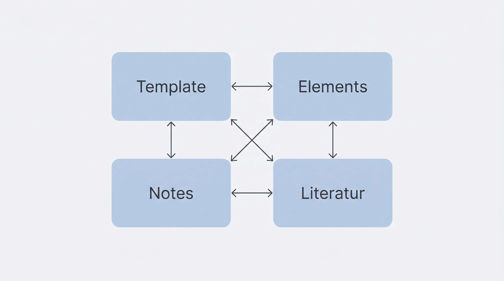

<!-- image: profile="academic" file="hero-einstieg.png"
A subtle atmospheric background composition: a softly glowing open notebook floating over a dark teal gradient, surrounded by faint geometric shapes (thin rounded rectangles, circles, delicate curved connector lines) suggesting documents and information flow. Ample negative space in the upper-left third for a title overlay. Low-contrast background art, no text, no people, no sharp focal points.
-->

# Einstieg ins Thema {background-image="images/hero-einstieg.png" background-opacity="0.7"}

::: {.notes}
Willkommen. Dieses Video zeigt, wie aus einer Agenda in wenigen Minuten ein fertiges Lernvideo entsteht.
:::

## Die Kernidee in einem Satz

::: {.formula}
Agenda + Template + Notes = Lernvideo
:::

::: {.notes}
Die Kernidee lässt sich in einem einzigen Satz zusammenfassen: Aus einer klaren Agenda, einem bewährten Template und vollständigen Speaker Notes entsteht automatisch ein fertiges Lernvideo.
:::

## Was das Template leistet

:::: {.features}

::: {.feature}
[]{.accent-blue}
**Struktur**

Konsistent über alle Decks.
:::

::: {.feature}
[]{.accent-green}
**KI-fähig**

Von der Agenda zum Deck.
:::

::: {.feature}
[]{.accent-violet}
**TTS-ready**

Notes direkt vertonbar.
:::

::::

::: {.notes}
Das Template leistet drei Dinge auf einen Blick: eine konsistente Struktur über alle Decks hinweg, eine KI-Fähigkeit, die aus einer Agenda direkt ein Deck macht, und eine Vertonbarkeit, weil die Speaker Notes sofort in der Text-to-Speech-Pipeline landen.
:::

<!-- image: profile="agentic_ai_diagrams" file="diagram-kernartefakte.png"
Clean minimal technical diagram showing four equally sized rounded rectangles arranged in a 2x2 grid: "Template", "Elements", "Notes", "Literatur". Thin monoline connectors between them suggesting interdependency. Muted blue accent color for the boxes, generous whitespace around the grid, flat vector style, no icons inside boxes, no people, no 3D, no text decoration. The diagram should feel balanced and architectural.
-->

## Vier Kernartefakte pro Deck

:::: {.columns}

::: {.column width="45%"}

:::

::: {.column width="55%"}
Jedes Deck steht auf **vier Bausteinen** — und nur auf diesen.

- **Template** gibt die Struktur.
- **Elements** liefert die Pattern.
- **Notes** tragen die Stimme.
- **Literatur** hält die Quellen.

:::{.sources}
Quelle: @kirenzQuartoTemplate2026
:::
:::

::::

::: {.notes}
Genau vier Kernartefakte bilden das Fundament jedes Decks.

Das Template gibt die Struktur vor, die Elements-Bibliothek liefert die Pattern, die Speaker Notes tragen die Stimme, und das Literaturverzeichnis hält die Quellen fest.

Mehr braucht es nicht.
:::

<!-- image: profile="agentic_ai_diagrams" file="hero-workflow.png"
Wide horizontal architecture diagram of a three-stage content pipeline. Left: a rounded rectangle labeled "Agenda". Center: a larger rounded rectangle labeled "KI + Template" as the orchestration hub with the muted blue accent. Right: a rounded rectangle labeled "Video". Thin monoline arrows connect left to center and center to right. Ample whitespace around the diagram, clean technical style, no decorative icons, no people, no 3D.
-->

# Der Workflow {background-image="images/hero-workflow.png" background-opacity="0.5" .center}

::: {.notes}
Der Weg vom leeren Blatt zum fertigen Video läuft in genau drei Schritten ab.
:::

## Schritt 1

::: {.big-stat}
[01]{.stat-number}
[Agenda schärfen]{.stat-label}
[Thema · Zielgruppe · Storyline]{.stat-context}
:::

::: {.notes}
Im ersten Schritt wird die Agenda geschärft. Thema festlegen, Zielgruppe klären, Storyline skizzieren. Diese drei Entscheidungen sind die Grundlage für alles Weitere.
:::

## Schritt 2

::: {.big-stat-green}
[02]{.stat-number}
[Deck erzeugen]{.stat-label}
[Pattern wählen · Folien schreiben · Notes ergänzen]{.stat-context}
:::

::: {.notes}
Im zweiten Schritt entsteht das Deck. Die KI wählt passende Pattern aus der Bibliothek, schreibt die Folien und ergänzt die Speaker Notes.
:::

## Schritt 3

::: {.big-stat-orange}
[03]{.stat-number}
[Output prüfen]{.stat-label}
[Validieren · Rendern · Exportieren]{.stat-context}
:::

::: {.notes}
Im dritten Schritt wird der Output geprüft. Das Deck wird validiert, gerendert und die Notes werden für die Text-to-Speech-Pipeline exportiert.
:::

## Die Pipeline im Überblick

```{.d2 file="includes/content-pipeline.d2"}
```

::: {.notes}
Das Diagramm zeigt den kompletten Fluss von der Agenda bis zum fertigen Video. Alle Schritte laufen automatisiert ab.
:::

# Drei Rollen {.center}

::: {.notes}
Im Workflow sind drei Rollen sauber voneinander getrennt.
:::

## Wer macht was

:::: {.features}

::: {.feature}
[]{.accent-blue}
**Autor:in**

Setzt die Richtung.
:::

::: {.feature}
[]{.accent-green}
**KI**

Baut das Deck.
:::

::: {.feature}
[]{.accent-violet}
**TTS**

Gibt die Stimme.
:::

::::

::: {.notes}
Die Autorin oder der Autor setzt die Richtung. Die KI baut daraus das Deck auf Basis der Pattern-Bibliothek. Und die Text-to-Speech-Pipeline gibt dem Ganzen am Ende die Stimme, die das Video hörbar macht.
:::

<!-- image: profile="minimal" file="hero-ready.png"
A single minimalist origami paper airplane in soft coral or muted orange, set against an expansive pure white background, casting no shadow. Positioned slightly off-center. The paper plane implies forward motion and readiness. Clean vector aesthetic, no text, no people, no decorative elements.
-->

# Ready to build {background-image="images/hero-ready.png" background-opacity="0.8" .center}

::: {.notes}
Damit ist alles beisammen. Das Template ist bereit — erste Agenda schreiben, Deck erzeugen lassen, vertonen, fertig.
:::

## Literatur

::: {#refs}
:::

::: {.notes}
Das Literaturverzeichnis wird automatisch aus den Zitationen im Deck gefüllt.
:::
